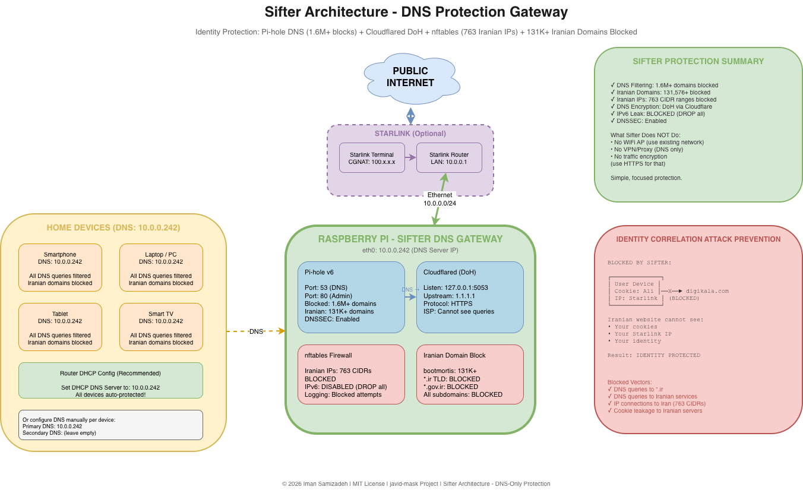
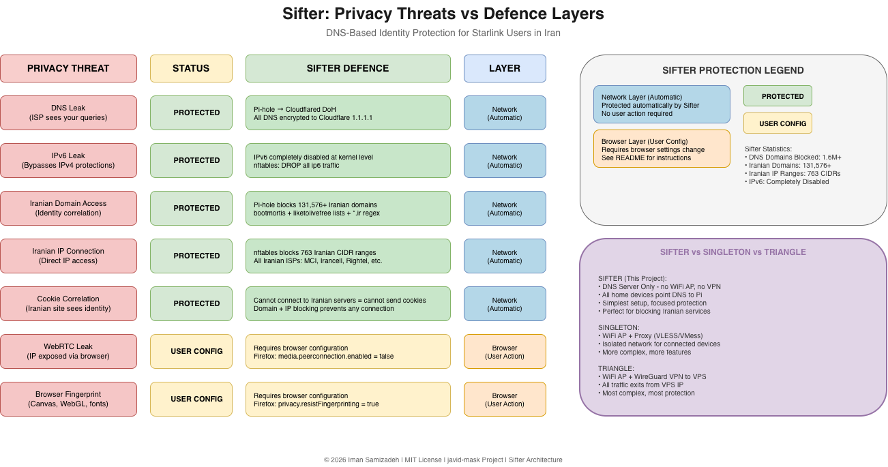

# Sifter - DNS Protection Gateway

**[English](README.md)** | **[فارسی](README.fa.md)**

A lightweight DNS-based identity protection gateway using Raspberry Pi. Sifter blocks Iranian domains and IPs at the network level, preventing identity correlation attacks for Starlink users in Iran.

**Author:** Iman Samizadeh
**Licence:** MIT
**Repository:** https://github.com/Iman/javid-mask
**Last Updated:** 2026-02-01

---

## Table of Contents

- [Executive Summary](#executive-summary)
- [The Identity Correlation Attack](#the-identity-correlation-attack)
- [Architecture](#architecture)
- [Features](#features)
- [Leak Protection Summary](#leak-protection-summary)
- [Prerequisites](#prerequisites)
- [Quick Start](#quick-start)
- [Configuration](#configuration)
- [Device Setup](#device-setup)
- [Browser Hardening Guide](#browser-hardening-guide)
- [MikroTik vs Raspberry Pi Comparison](#mikrotik-vs-raspberry-pi-comparison)
- [Troubleshooting](#troubleshooting)
- [Maintenance](#maintenance)
- [Licence](#licence)

---

## Architecture Diagrams

### Network Architecture



### Leak Protection



---

## Executive Summary

**Sifter** is the simplest architecture in the javid-mask project. It provides:

- **DNS-level filtering** with Pi-hole blocking 1.6M+ malicious domains
- **Iranian domain blocking** with 131,576+ domains from bootmortis repository
- **Iranian IP blocking** with 763 CIDR ranges via nftables
- **Encrypted DNS** through DNS-over-HTTPS to Cloudflare
- **IPv6 leak prevention** by completely disabling IPv6

Unlike Singleton (WiFi AP + Proxy) or Triangle (WiFi AP + WireGuard VPN), Sifter is a pure DNS server. You simply point your devices' DNS settings to the Raspberry Pi, and all DNS queries are filtered and encrypted.

**Use Sifter when:**
- You want the simplest possible protection
- You don't need a separate WiFi network
- You want to protect all devices on your existing network
- DNS-level blocking is sufficient for your threat model

---

## The Identity Correlation Attack

### Why This Project Exists

When a Starlink user in Iran accidentally visits an Iranian website, their identity can be correlated through cookies, browser fingerprints, or login sessions:

```
BEFORE (Normal Iranian ISP):
┌──────────────┐      ┌─────────────────┐
│ User         │─────►│ Iranian Website │
│ Cookie: Reza │      │ (digikala.com)  │
│ IP: Iran     │      │ Logs: Reza=Iran │
└──────────────┘      └─────────────────┘

AFTER (Starlink - DANGEROUS):
┌──────────────┐      ┌─────────────────┐
│ User         │─────►│ Iranian Website │
│ Cookie: Reza │      │ (digikala.com)  │
│ IP: USA!     │      │ Logs: Reza=USA!!│  ◄── RED FLAG
└──────────────┘      └─────────────────┘       "Reza has Starlink"
```

### Attack Vectors

| Vector | Risk | Sifter Defence |
|--------|------|----------------|
| Cookies | Iranian site recognises returning user | Block domain = no connection |
| Browser fingerprint | Canvas, WebGL identify device | Block domain = no fingerprint sent |
| DNS query | Query to Iranian DNS reveals intent | Block at DNS level |
| Direct IP | Analytics, CDN, embedded content | Block all Iranian IP ranges |
| Login session | Authenticated session reveals identity | Cannot reach login server |

### Sifter Defence

Sifter completely blocks connections to Iranian servers at two levels:

1. **DNS Level**: Pi-hole returns `0.0.0.0` for 131,576+ Iranian domains
2. **IP Level**: nftables drops packets to 763 Iranian CIDR ranges

Result: Your device cannot connect to Iranian servers, so cookies/fingerprints/identity cannot leak.

---

## Architecture

### Network Topology

```
                    ┌─────────────────────┐
                    │     INTERNET        │
                    └──────────┬──────────┘
                               │
                    ┌──────────▼──────────┐
                    │  STARLINK TERMINAL  │
                    │   (or any router)   │
                    └──────────┬──────────┘
                               │
                    ┌──────────▼──────────┐
                    │   HOME ROUTER       │
                    │   LAN: 10.0.0.1     │
                    └──────────┬──────────┘
                               │
          ┌────────────────────┼────────────────────┐
          │                    │                    │
┌─────────▼─────────┐ ┌────────▼────────┐ ┌────────▼────────┐
│   RASPBERRY PI    │ │   Your Phone    │ │   Your Laptop   │
│   SIFTER DNS      │ │   DNS: Pi IP    │ │   DNS: Pi IP    │
│   10.0.0.242      │ │                 │ │                 │
│                   │ │                 │ │                 │
│   Services:       │ └─────────────────┘ └─────────────────┘
│   • Pi-hole       │
│   • Cloudflared   │   All devices use Pi as DNS server
│   • nftables      │   All DNS queries filtered & encrypted
└───────────────────┘
```

### How It Works

1. **Device sends DNS query** → `digikala.com`
2. **Pi-hole receives query** → Checks blocklist (131K+ Iranian domains)
3. **If blocked** → Returns `0.0.0.0` (connection refused)
4. **If allowed** → Forwards to Cloudflared (DoH)
5. **Cloudflared encrypts** → Sends to Cloudflare 1.1.1.1 over HTTPS
6. **ISP cannot see** → Your DNS queries are encrypted

### What Sifter Does NOT Do

| Feature | Sifter | Singleton | Triangle |
|---------|--------|-----------|----------|
| DNS Filtering | ✅ | ✅ | ✅ |
| Iranian Domain Blocking | ✅ | ✅ | ✅ |
| Iranian IP Blocking | ✅ | ✅ | ✅ |
| WiFi Access Point | ❌ | ✅ | ✅ |
| Proxy (VLESS/VMess) | ❌ | ✅ | ❌ |
| VPN (WireGuard) | ❌ | ❌ | ✅ |
| Traffic Encryption | ❌ | ✅ | ✅ |
| IP Masking | ❌ | ❌ | ✅ |

Sifter is DNS-only. It blocks connections but doesn't encrypt your traffic (use HTTPS for that) or hide your IP (use VPN/Proxy for that).

---

## Features

### DNS Protection

- **Pi-hole v6**: 1.6M+ domains blocked from 17+ blocklists
- **Iranian Domains**: 131,576+ from bootmortis/iran-hosted-domains
- **Iranian TLDs**: Regex blocking for `*.ir`, `*.gov.ir`, `*.ac.ir`, etc.
- **DNSSEC**: Cryptographic verification of DNS responses
- **Rate Limiting**: 1000 queries/60 seconds per client

### DNS Encryption

- **Cloudflared**: DNS-over-HTTPS proxy
- **Upstream**: Cloudflare 1.1.1.1 (privacy-focused)
- **ISP Blindness**: ISP cannot see your DNS queries
- **Bypass Blocks**: Works even if ISP blocks port 53

### Firewall Protection

- **Iranian IP Blocking**: 763 CIDR ranges (nftables)
- **IPv6 Disabled**: Complete DROP of all IPv6 traffic
- **Logging**: Blocked connection attempts logged
- **Auto-Update**: Daily update of IP blocklist

### Blocklists Included

| Category | Source | Domains | Updates |
|----------|--------|---------|---------|
| Unified Hosts | StevenBlack/hosts | 150,000+ | Daily |
| Privacy | EasyPrivacy | 25,000+ | Weekly |
| Ads | Prigent-Ads | 50,000+ | Daily |
| Phishing | Phishing Army | 30,000+ | Hourly |
| Malware | Malware Domains | 20,000+ | Daily |
| Iranian Domains | bootmortis/iran-hosted-domains | 131,576+ | Weekly |

---

## Leak Protection Summary

### Current Protection Status

| Leak Type | Protection Status | Implementation |
|-----------|-------------------|----------------|
| **DNS Leak** | ✅ Protected | Pi-hole → Cloudflared DoH (encrypted) |
| **IPv6 Leak** | ✅ Protected | IPv6 completely disabled at nftables (DROP all ip6) |
| **Iranian Domain Leak** | ✅ Protected | 131,576+ domains blocked at DNS level |
| **Iranian IP Leak** | ✅ Protected | 763 CIDR ranges blocked at firewall |
| **Cookie Correlation** | ✅ Protected | Cannot connect to Iranian servers = no cookie leak |
| **WebRTC Leak** | ⚠️ Requires Browser Config | Network-level cannot block; configure browser |
| **Browser Fingerprint** | ⚠️ Requires Browser Config | Network-level cannot block; configure browser |

### Network vs Browser Protection

```
NETWORK LEVEL (✅ Automatic via Sifter):
├── DNS queries → Pi-hole → Cloudflared DoH (encrypted)
├── IPv6 traffic → DROP (nftables ip6 filter)
├── Iranian IPs → DROP (nftables, 763 CIDR ranges)
└── Iranian domains → 0.0.0.0 (Pi-hole, 131,576+ domains)

BROWSER LEVEL (⚠️ User must configure):
├── WebRTC → Disable in browser settings
├── JavaScript fingerprinting → Use uBlock Origin, NoScript
├── Canvas fingerprinting → Firefox resistFingerprinting
└── Cookie tracking → Use Cookie AutoDelete extension
```

---

## Prerequisites

### Hardware Requirements

| Component | Minimum | Recommended | Notes |
|-----------|---------|-------------|-------|
| Raspberry Pi | Pi 3B+ | Pi 5 (4GB) | Pi 5 significantly faster |
| MicroSD Card | 16GB Class 10 | 32GB A2 | A2 rating for better random I/O |
| Ethernet | 100Mbps | 1Gbps | Gigabit for full Starlink speed |
| Power Supply | 5V 2.5A | 5V 5A (Pi 5) | Official PSU recommended |

### Software on Raspberry Pi

- **OS**: Raspberry Pi OS (Debian 13 "Trixie" or newer)
- **SSH**: Enabled with user account (e.g., `admin`)
- **Sudo**: User must have passwordless sudo
- **Network**: Static IP or DHCP reservation (default: 10.0.0.242)

### Software on Control Machine

- **OS**: macOS, Linux, or Windows (WSL2)
- **Ansible**: Version 2.9+ (`pip install ansible` or `brew install ansible`)
- **SSH**: Client with key or password authentication
- **Python**: Version 3.8+ (for Ansible)

---

## Quick Start

### 1. Clone the Repository

```bash
git clone https://github.com/Iman/javid-mask.git
cd javid-mask/sifter/ansible
```

### 2. Configure Inventory

Edit `inventory.yml`:

```yaml
all:
  hosts:
    raspberry_pi:
      ansible_host: 10.0.0.242
      ansible_user: admin
      ansible_python_interpreter: /usr/bin/python3
```

### 3. Review Configuration

Edit `group_vars/all.yml`:

```yaml
# Raspberry Pi Static IP
pi_static_ip: 10.0.0.242
pi_gateway: 10.0.0.1

# Pi-hole settings
pihole_web_password: "YourSecurePassword"
pihole_dnssec_enabled: true

# Security features
block_iranian_ips: true
block_iranian_domains: true
ipv6_disabled: true
cloudflared_enabled: true
```

### 4. Test Connection

```bash
ansible all -i inventory.yml -m ping
```

### 5. Run Deployment

```bash
ansible-playbook -i inventory.yml playbook.yml
```

### 6. Get Credentials

```bash
cat credentials.txt
```

### 7. Configure Your Devices

Set DNS on your devices to `10.0.0.242` (see [Device Setup](#device-setup)).

---

## Configuration

### Pi-hole Admin Panel

Access at **http://10.0.0.242/admin**

**Features:**
- View blocked queries in real-time
- Whitelist/blacklist domains
- View query statistics
- Manage blocklists

### DNS Settings

| Setting | Value | Purpose |
|---------|-------|---------|
| Upstream DNS | 127.0.0.1#5053 | Cloudflared DoH |
| DNSSEC | Enabled | DNS response verification |
| Rate Limit | 1000/60s | Prevent DNS abuse |
| Blocking Mode | NULL | Return 0.0.0.0 for blocked |

---

## Device Setup

### Option 1: Router DHCP (Recommended)

Configure your router to distribute the Pi's IP as DNS:

1. Access router admin (usually http://192.168.1.1 or http://10.0.0.1)
2. Find DHCP settings
3. Set **DNS Server** to `10.0.0.242`
4. Save and reboot router
5. All devices auto-protected!

### Option 2: Manual Per-Device

**Windows:**
1. Settings → Network & Internet → Change adapter options
2. Right-click adapter → Properties
3. Select "Internet Protocol Version 4" → Properties
4. Select "Use the following DNS server addresses"
5. Enter: `10.0.0.242`

**macOS:**
1. System Preferences → Network
2. Select connection → Advanced → DNS
3. Click + and add: `10.0.0.242`
4. Remove other DNS servers

**iOS:**
1. Settings → Wi-Fi → (i) next to network
2. Configure DNS → Manual
3. Delete existing servers, add: `10.0.0.242`

**Android:**
1. Settings → Network & Internet → Wi-Fi
2. Long-press network → Modify network
3. Advanced options → IP settings: Static
4. Set DNS 1: `10.0.0.242`

**Linux:**
```bash
# /etc/resolv.conf
nameserver 10.0.0.242
```

Or via NetworkManager:
```bash
nmcli con mod "Your Connection" ipv4.dns "10.0.0.242"
nmcli con up "Your Connection"
```

---

## Browser Hardening Guide

For complete protection, configure your browser:

### Firefox (Recommended)

```
about:config settings:
├── media.peerconnection.enabled → false     (Disable WebRTC)
├── media.navigator.enabled → false          (Disable media devices)
├── privacy.resistFingerprinting → true      (Anti-fingerprinting)
├── network.dns.disableIPv6 → true           (Disable IPv6 DNS)
├── geo.enabled → false                      (Disable geolocation)
├── dom.battery.enabled → false              (Disable battery API)
└── privacy.trackingprotection.enabled → true
```

### Recommended Extensions

| Extension | Purpose |
|-----------|---------|
| uBlock Origin | Ad/tracker blocking, WebRTC control |
| NoScript | JavaScript control |
| Cookie AutoDelete | Automatic cookie cleanup |
| HTTPS Everywhere | Force HTTPS connections |
| Decentraleyes | Local CDN emulation |

### Chrome/Chromium

```
chrome://flags settings:
├── WebRTC IP handling policy → Disable non-proxied UDP
└── Enable: chrome://settings/content/sensors → Block

Extensions:
├── WebRTC Leak Prevent
├── uBlock Origin
└── Cookie AutoDelete
```

### Mobile (Android)

- Use **Firefox Focus** or **Brave Browser**
- Disable WebRTC in browser settings
- Use private/incognito mode for sensitive browsing

---

## MikroTik vs Raspberry Pi Comparison

### Why Raspberry Pi Instead of MikroTik?

Some users may ask if a MikroTik router can provide the same protection. While MikroTik is excellent networking hardware, it has critical limitations for this privacy protection use case:

| Feature | MikroTik | Raspberry Pi | Winner |
|---------|----------|--------------|--------|
| **DNS Blocking (1.6M+ domains)** | ❌ Max ~100K | ✅ 1.6M+ unlimited | Raspberry Pi |
| **Iranian Domain Blocking (131K+)** | ❌ Insufficient resources | ✅ Full support | Raspberry Pi |
| **DNS-over-HTTPS (DoH)** | ⚠️ Limited (v7+ only) | ✅ Full (Cloudflared) | Raspberry Pi |
| **Iranian IP Blocking (763 CIDRs)** | ✅ Supported | ✅ Supported | Tie |
| **Web Management Tools** | ✅ WebFig/WinBox | ✅ Pi-hole Panel | Tie |
| **Power Consumption** | ✅ ~5W | ⚠️ ~10-15W | MikroTik |
| **Cost** | ~$50-100 | ~$80-120 (Pi 5 + SD) | Tie |
| **Software Flexibility** | ⚠️ RouterOS limited | ✅ Full Linux | Raspberry Pi |

### Key MikroTik Limitations

**1. DNS Blocklist Capacity**

MikroTik devices have hardware limits on DNS regex entries:
- Entry-level models: ~10,000 entries
- Mid-range models: ~50,000 entries
- High-end models: ~100,000 entries

Our use case requires:
- Pi-hole blocklists: 1.6M+ domains
- Iranian domains: 131,576+ domains
- **Total**: Need 1.7M+ domain capacity

**2. DoH Limitations**

- Only RouterOS v7+ supports DoH
- More complex configuration than Cloudflared
- Lower performance under heavy load

### When MikroTik Is Recommended

MikroTik is suitable for:
- ✅ Simple DNS filtering (thousands, not millions)
- ✅ Advanced routing and switching
- ✅ Bandwidth management and QoS
- ✅ Enterprise networks
- ✅ Implementations needing IP blocking only

For our specific scenario (Starlink identity protection with comprehensive DNS filtering and Iranian domains), **Raspberry Pi is the only practical choice**.

---

## Troubleshooting

### DNS Not Resolving

```bash
# Check Pi-hole status
ssh admin@10.0.0.242
pihole status

# Check Cloudflared
sudo systemctl status cloudflared

# Test DNS resolution
nslookup google.com 10.0.0.242
```

### Pi-hole Shows No Queries

```bash
# Check if device is using Pi DNS
nslookup -debug google.com

# Verify DNS setting on device
# Should show 10.0.0.242 as DNS server
```

### Iranian Domains Not Blocked

```bash
# Test if domain is blocked
nslookup digikala.com 10.0.0.242
# Should return 0.0.0.0

# Update gravity database
pihole -g

# Check regex list
cat /etc/pihole/regex.list
```

### Iranian IPs Not Blocked

```bash
# Check nftables status
sudo systemctl status nftables

# Verify blocklist loaded
sudo nft list set inet sifter iranian_blocklist | grep -c "/"

# Manual update
sudo /usr/local/bin/update-sifter-firewall.sh
```

---

## Maintenance

### System Updates

```bash
ssh admin@10.0.0.242
sudo apt update && sudo apt upgrade -y
pihole -up
```

### Blocklist Updates

```bash
# Update Pi-hole gravity
pihole -g

# Update Iranian IP blocklist
sudo /usr/local/bin/update-sifter-firewall.sh
```

### View Logs

```bash
# Pi-hole query log
sudo journalctl -u pihole-FTL -f

# Cloudflared log
sudo journalctl -u cloudflared -f

# Blocked Iranian connections
sudo journalctl -t kernel --grep=SIFTER_BLOCKED -f
```

### Redeploy Configuration

```bash
# Full redeploy
ansible-playbook -i inventory.yml playbook.yml

# Specific roles
ansible-playbook -i inventory.yml playbook.yml --tags pihole
ansible-playbook -i inventory.yml playbook.yml --tags firewall
```

---

## Directory Structure

```
sifter/
├── ansible/
│   ├── inventory.yml
│   ├── playbook.yml
│   ├── group_vars/
│   │   └── all.yml
│   ├── files/
│   │   └── iranian-ips.txt
│   └── roles/
│       ├── prerequisites/
│       ├── network/
│       ├── pihole/
│       ├── cloudflared/
│       └── firewall/
├── diagrams/
│   ├── network-architecture.drawio
│   └── leak-protection.drawio
├── credentials.txt
├── README.md
└── README.fa.md
```

---

## Security Considerations

### What Sifter Protects Against

| Threat | Protection |
|--------|------------|
| DNS query logging by ISP | All DNS encrypted via DoH |
| Iranian domain access | 131,576+ domains blocked |
| Iranian IP connections | 763 CIDR ranges blocked |
| IPv6 leaks | IPv6 completely disabled |
| Identity correlation | Cannot connect = cannot leak |

### What Sifter Does NOT Protect Against

| Threat | Reason | Mitigation |
|--------|--------|------------|
| Traffic analysis | No VPN/encryption | Use HTTPS everywhere |
| IP tracking | Your IP visible to non-Iranian sites | Use VPN or Triangle architecture |
| Endpoint compromise | Malware on device | Endpoint security software |
| Browser fingerprinting | JavaScript-based | Configure browser (see guide) |

---

## Licence

MIT Licence

Copyright (c) 2026 Iman Samizadeh

---

## Credits

- **Pi-hole**: https://pi-hole.net/
- **Cloudflared**: https://developers.cloudflare.com/
- **nftables**: https://netfilter.org/projects/nftables/
- **Iranian Domains**: https://github.com/bootmortis/iran-hosted-domains
- **Iranian IPs**: https://github.com/herrbischoff/country-ip-blocks

---

## Deployment Status

| Component | Status | Details |
|-----------|--------|---------|
| Pi-hole DNS | Operational | 1.6M+ domains blocked |
| Cloudflared DoH | Operational | Cloudflare 1.1.1.1 |
| Iranian Domains | Operational | 131,576+ blocked |
| Iranian IPs | Operational | 763 CIDRs blocked |
| IPv6 Block | Operational | Complete DROP |
| nftables Firewall | Operational | Stateful filtering |

---

**Maintainer**: Iman Samizadeh
**Architecture**: Sifter (DNS-Only Protection Gateway)
**Upstream Router**: Starlink Terminal (or any router)
