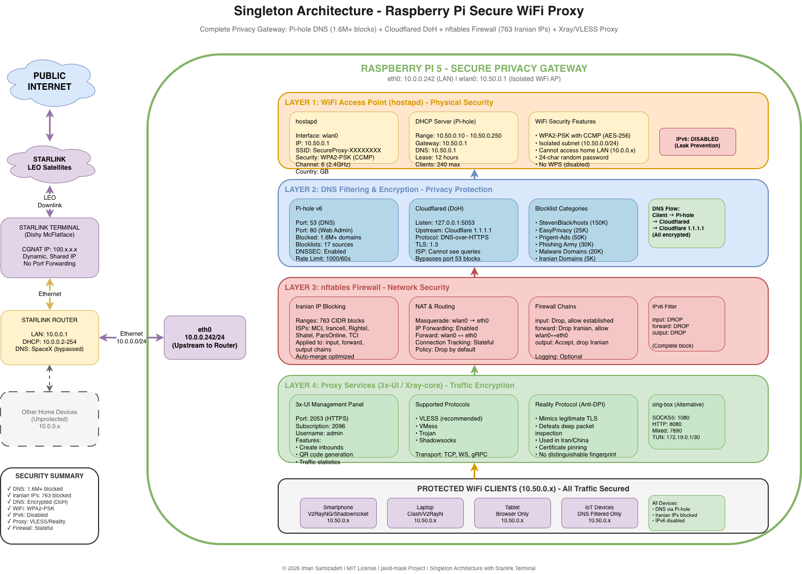
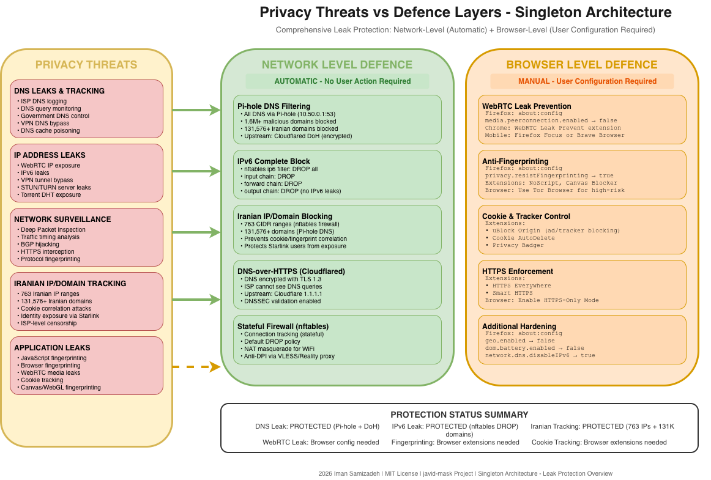

<div dir="rtl" lang="fa">

# پراکسی امن WiFi با رزبری پای (سینگلتون)

<div dir="ltr">

**[English](README.md)** | **[فارسی](README.fa.md)**

</div>

یک راه‌حل جامع و خودکار با Ansible برای تبدیل رزبری پای به یک نقطه دسترسی WiFi امن با فیلترینگ DNS، مسدودسازی IP/دامنه‌های ایرانی و پشتیبانی از پروتکل‌های VLESS/VMess. تمام سرویس‌ها روی یک دستگاه اجرا می‌شوند.

**نویسنده:** ایمان سمیع‌زاده
**مجوز:** MIT
**مخزن:** https://github.com/Iman/javid-mask
**آخرین بروزرسانی:** ۱۴۰۴/۱۱/۱۲

---

## فهرست مطالب

- [خلاصه اجرایی](#خلاصه-اجرایی)
- [تهدیدات حریم خصوصی و معماری دفاعی](#تهدیدات-حریم-خصوصی-و-معماری-دفاعی)
- [مدل امنیتی](#مدل-امنیتی)
- [ویژگی‌ها](#ویژگی‌ها)
- [معماری](#معماری)
- [یکپارچه‌سازی با استارلینک](#یکپارچه‌سازی-با-استارلینک)
- [پیش‌نیازها](#پیش‌نیازها)
- [شروع سریع](#شروع-سریع)
- [پیکربندی](#پیکربندی)
- [استفاده](#استفاده)
- [جلوگیری از نشت DNS](#جلوگیری-از-نشت-dns)
- [سخت‌سازی امنیتی](#سخت‌سازی-امنیتی)
- [عیب‌یابی](#عیب‌یابی)
- [نگهداری](#نگهداری)
- [مجوز](#مجوز)

---

## نمودارهای معماری

### معماری شبکه



### جریان داده


### حفاظت از نشت



---

## خلاصه اجرایی

معماری **سینگلتون** یک دروازه حریم خصوصی مستقل روی یک رزبری پای فراهم می‌کند. این معماری یک شبکه WiFi ایزوله ایجاد می‌کند که تمام دستگاه‌های متصل از امکانات زیر بهره‌مند می‌شوند:

- **فیلترینگ سطح DNS** با مسدودسازی بیش از ۱.۶ میلیون دامنه مخرب
- **DNS رمزشده** از طریق DNS-over-HTTPS به Cloudflare
- **مسدودسازی IP ایرانی** با جلوگیری از ترافیک به/از ۷۶۳ رنج CIDR
- **پشتیبانی از پراکسی** برای پروتکل‌های VLESS/VMess با پنهان‌سازی Reality
- **جداسازی شبکه** با جدا کردن کلاینت‌های WiFi از شبکه خانگی

این راه‌حل برای کاربرانی مناسب است که می‌خواهند حفاظت جامع حریم خصوصی بدون نیاز به VPS یا زیرساخت توزیع‌شده پیچیده داشته باشند.

---

## تهدیدات حریم خصوصی و معماری دفاعی

### چرا این پروژه وجود دارد

کاربران اینترنت امروزی با تهدیدات نظارتی و حریم خصوصی بی‌سابقه‌ای از چندین منبع روبرو هستند: سازمان‌های دولتی، ISPها، شرکت‌های بزرگ و عوامل مخرب. این پروژه به نشت‌های حیاتی حریم خصوصی می‌پردازد که هویت، موقعیت و فعالیت‌های آنلاین کاربر را حتی هنگام استفاده از VPN یا پراکسی افشا می‌کند.

### مدل تهدید

این پروژه در برابر موارد زیر دفاع می‌کند:

| عامل تهدید | بردار حمله | لایه دفاعی |
|------------|------------|------------|
| ISP | ثبت DNS، تحلیل ترافیک | رمزنگاری DoH، تونل پراکسی |
| دولت | DPI، همبستگی IP | پروتکل Reality، مسدودسازی IP ایرانی |
| تبلیغ‌کنندگان | دامنه‌های ردیابی، فینگرپرینتینگ | لیست‌های مسدودی Pi-hole (بیش از ۱.۶ میلیون) |
| بدافزار | سرورهای C2، دامنه‌های فیشینگ | لیست‌های امنیتی، DNSSEC |
| مهاجمان محلی | شنود شبکه، جعل ARP | WPA2-PSK، جداسازی شبکه |

### تهدیدات حیاتی حریم خصوصی

#### ۱. ردیابی و سوءاستفاده مبتنی بر DNS

**نشت DNS**: خطرناک‌ترین نشت حریم خصوصی

- **ثبت DNS توسط ISP**: ISP شما هر دامنه‌ای که کوئری می‌کنید را ثبت می‌کند و یک پروفایل کامل مرور ایجاد می‌کند
- **نشت DNS از VPN**: VPNهای با پیکربندی نادرست ممکن است کوئری‌های DNS را خارج از تونل رمزشده ارسال کنند
- **نشت WebRTC**: WebRTC مرورگر می‌تواند کوئری‌های DNS را حتی از طریق پراکسی افشا کند
- **نشت DNS از IPv6**: وقتی VPN/پراکسی فقط IPv4 را مدیریت می‌کند، کوئری‌های DNS از IPv6 نشت می‌کند
- **کش DNS سیستم عامل**: کش DNS سیستم عامل تاریخچه مرور را به مهاجمان محلی افشا می‌کند

**جعل و ربودن DNS**:

- حملات مرد میانی برای تغییر مسیر کوئری‌های DNS
- تزریق DNS توسط ISP برای درج ردیابی/تبلیغات
- سرورهای DNS مخرب که IPهای آلوده برمی‌گردانند
- حملات DNS rebinding برای دسترسی به شبکه‌های داخلی

#### ۲. افشای آدرس IP

**نشت مستقیم IP**:

- کوئری‌های سرور STUN/TURN در WebRTC آدرس IP واقعی را افشا می‌کند
- اعلان‌های DHT تورنت آدرس IP را فاش می‌کند
- هدرهای ایمیل ممکن است حاوی IP مبدا باشند
- پلاگین‌های مرورگر ممکن است تنظیمات پراکسی را دور بزنند

**حملات همبستگی IP**:

- تحلیل زمان‌بندی ترافیک برای همبستگی نقاط ورود/خروج
- الگوهای ترافیک منحصربه‌فرد برای شناسایی کاربران
- خوشه‌بندی IP جغرافیایی برای فاش کردن الگوهای موقعیت
- ردیابی چندجلسه‌ای در تغییرات IP

#### ۳. بازرسی عمیق بسته (DPI)

**فینگرپرینتینگ پروتکل**:

- فینگرپرینتینگ TLS (هش‌های JA3/JA4)
- تحلیل هدر HTTP
- تحلیل زمان‌بندی و اندازه بسته
- شناسایی پروتکل لایه کاربرد

**قابلیت‌های DPI ایران**:

- کاوش فعال سرورهای پراکسی مشکوک
- لیست سفید پروتکل (مسدودسازی پروتکل‌های ناشناخته)
- فیلترینگ مبتنی بر SNI
- فینگرپرینتینگ گواهینامه

#### ۴. حمله همبستگی هویت (نشت کوکی/فینگرپرینت)

**تهدید افشای هویت استارلینک**:

وقتی یک کاربر با استارلینک (IP خارجی) به‌طور تصادفی از یک وب‌سایت ایرانی بازدید می‌کند، هویت او می‌تواند همبسته شود:

<div dir="ltr">

```
قبل (ISP معمولی ایرانی):
┌──────────────┐      ┌─────────────────┐
│ کاربر        │─────►│ وب‌سایت ایرانی  │
│ کوکی: رضا    │      │ (digikala.com)  │
│ IP: ایران    │      │ لاگ: رضا=ایران  │
└──────────────┘      └─────────────────┘

بعد (استارلینک - خطرناک):
┌──────────────┐      ┌─────────────────┐
│ کاربر        │─────►│ وب‌سایت ایرانی  │
│ کوکی: رضا    │      │ (digikala.com)  │
│ IP: آمریکا!  │      │ لاگ: رضا=آمریکا!│  ◄── پرچم قرمز
└──────────────┘      └─────────────────┘       "رضا استارلینک دارد"
```

</div>

**بردارهای حمله**:

- **همبستگی کوکی**: همان کوکی کاربر + IP خارجی = هویت افشا شده
- **فینگرپرینت مرورگر**: Canvas، WebGL، فونت‌ها دستگاه را در IPهای مختلف شناسایی می‌کنند
- **جلسات ورود**: جلسات احراز هویت شده هویت را فاش می‌کنند
- **هدرهای Referrer**: الگوهای ناوبری را نشان می‌دهند

**دفاع سینگلتون**: مسدودسازی کامل دامنه ایرانی در سطح DNS از هرگونه اتصال به سرورهای ایرانی جلوگیری می‌کند و حمله همبستگی را کاملاً از بین می‌برد.

#### ۵. ردیابی IP/دامنه ایرانی

**چرا مسدودسازی IP ایرانی مهم است**:

- **۷۶۳ رنج CIDR فعال** که ISPهای اصلی ایران را پوشش می‌دهد:
  - همراه اول (MCI)
  - ایرانسل (MTN Irancell)
  - رایتل
  - شاتل
  - پارس‌آنلاین
  - مخابرات (TCI)
  - آسیاتک
  - افرانت
- مراکز داده دولتی و زیرساخت نظارتی
- همبستگی ترافیک در سرویس‌های میزبانی شده در ایران
- ذخیره اجباری داده توسط ISPهای ایرانی

### چگونه سینگلتون در برابر این تهدیدات دفاع می‌کند

#### لایه دفاعی ۱: فیلترینگ DNS با Pi-hole

<div dir="ltr">

```
WiFi Client → Pi-hole (10.50.0.1:53)
    ├── Query: ads.tracker.com
    │   └── BLOCKED (returns 0.0.0.0)
    │       Source: EasyPrivacy blocklist
    │
    └── Query: legitimate-site.com
        └── ALLOWED → Cloudflared (DoH)
            └── Cloudflare 1.1.1.1 (encrypted)
```

</div>

**حفاظت ارائه شده**:

- بیش از ۱.۶ میلیون دامنه مخرب/ردیابی مسدود
- کوئری‌ها هرگز شبکه شما را بدون رمزنگاری ترک نمی‌کنند
- هیچ لاگ DNS روی سرورهای شخص ثالث ذخیره نمی‌شود
- اعتبارسنجی DNSSEC از جعل DNS جلوگیری می‌کند

#### لایه دفاعی ۲: DNS-over-HTTPS (Cloudflared)

<div dir="ltr">

```
Pi-hole → Cloudflared (127.0.0.1:5053)
    └── HTTPS/443 → Cloudflare 1.1.1.1
        ├── Encrypted DNS query
        ├── Certificate validation
        └── No ISP visibility into queries
```

</div>

**حفاظت ارائه شده**:

- کوئری‌های DNS با TLS 1.3 رمزنگاری می‌شوند
- ISP نمی‌تواند ببیند چه دامنه‌هایی کوئری می‌کنید
- ربودن DNS توسط ISP را دور می‌زند
- سیاست حریم خصوصی Cloudflare

#### لایه دفاعی ۳: فایروال nftables + مسدودسازی IP ایرانی

<div dir="ltr">

```nft
table inet filter {
    set iranian_blocklist {
        type ipv4_addr
        flags interval
        auto-merge
        elements = {
            2.144.0.0/14,      # MCI
            5.52.0.0/15,       # Shatel
            5.160.0.0/15,      # Respina
            ... (763 ranges total)
        }
    }

    chain input { ... }
    chain forward { ... }
    chain output { ... }
}
```

</div>

**حفاظت ارائه شده**:

- تمام ترافیک به/از IPهای ایرانی مسدود
- ردیابی اتصال Stateful از جعل جلوگیری می‌کند
- ثبت تلاش‌های اتصال مسدود شده
- بهینه‌سازی auto-merge کارایی قوانین را افزایش می‌دهد

#### لایه دفاعی ۴: پراکسی 3x-UI Xray (VLESS/VMess)

**حفاظت ارائه شده**:

- ترافیک با رمزهای مدرن رمزنگاری می‌شود
- پروتکل Reality تحلیل DPI را شکست می‌دهد
- به عنوان ترافیک HTTPS قانونی ظاهر می‌شود
- بدون فینگرپرینت پراکسی قابل تشخیص

#### لایه دفاعی ۵: جداسازی شبکه

<div dir="ltr">

```
Home LAN (10.0.0.0/24)
    │
    └── Raspberry Pi
        ├── eth0: 10.0.0.242 (home network)
        └── wlan0: 10.50.0.1 (isolated WiFi)
            └── WiFi Clients (10.50.0.x)
```

</div>

**حفاظت ارائه شده**:

- کلاینت‌های WiFi از دستگاه‌های شبکه خانگی ایزوله
- دستگاه‌های IoT آلوده نمی‌توانند به صورت جانبی گسترش یابند
- تمام ترافیک WiFi مجبور به عبور از پشته امنیتی
- تقسیم‌بندی شبکه واضح

---

## خلاصه حفاظت از نشت

### وضعیت حفاظت فرضا در برابر نشت‌ها

| نوع نشت | وضعیت حفاظت | پیاده‌سازی |
|---------|-------------|------------|
| **نشت DNS** | ✅ محافظت شده | Pi-hole تمام DNS را از طریق resolver محلی → Cloudflared DoH (رمزشده) هدایت می‌کند |
| **نشت IPv6** | ✅ محافظت شده | IPv6 به‌طور کامل در سطح nftables غیرفعال است (DROP تمام ترافیک ip6) |
| **نشت WebRTC** | ⚠️ نیاز به تنظیم مرورگر | نیاز به کاهش در سطح مرورگر دارد (نه سطح شبکه) |
| **نشت دامنه ایرانی** | ✅ محافظت شده | بیش از ۱۳۱,۵۷۶ دامنه در سطح DNS مسدود (bootmortis + liketolivefree) |
| **نشت IP ایرانی** | ✅ محافظت شده | ۷۶۳ رنج CIDR در سطح فایروال مسدود |
| **همبستگی کوکی** | ✅ محافظت شده | مسدودسازی دامنه‌های ایرانی از نشت کوکی به سرورهای ایرانی جلوگیری می‌کند |

### آنچه پوشش داده شده در مقابل آنچه نیاز به پیکربندی مرورگر دارد

<div dir="ltr">

```
NETWORK LEVEL (✅ توسط سینگلتون کاملاً محافظت شده):
├── DNS queries → Pi-hole → Cloudflared DoH (رمزشده)
├── IPv6 traffic → DROP (nftables ip6 filter)
├── Iranian IPs → DROP (nftables, 763 رنج CIDR)
├── Iranian domains → 0.0.0.0 (Pi-hole, 131,576+ دامنه)
└── All WiFi traffic → از طریق پشته امنیتی

BROWSER LEVEL (⚠️ کاربر باید پیکربندی کند):
├── WebRTC → غیرفعال در تنظیمات مرورگر
├── JavaScript fingerprinting → استفاده از uBlock Origin, NoScript
├── Canvas fingerprinting → Firefox resistFingerprinting
└── Cookie tracking → استفاده از افزونه Cookie AutoDelete
```

</div>

### راهنمای سخت‌سازی مرورگر

برای دستیابی به حفاظت کامل از نشت، مرورگر خود را پیکربندی کنید:

**Firefox (توصیه شده)**:

<div dir="ltr">

```
تنظیمات about:config:
├── media.peerconnection.enabled → false     (غیرفعال WebRTC)
├── media.navigator.enabled → false          (غیرفعال دستگاه‌های رسانه)
├── privacy.resistFingerprinting → true      (ضد فینگرپرینتینگ)
├── network.dns.disableIPv6 → true           (غیرفعال DNS IPv6)
├── geo.enabled → false                      (غیرفعال موقعیت‌یابی)
├── dom.battery.enabled → false              (غیرفعال API باتری)
└── privacy.trackingprotection.enabled → true
```

</div>

**افزونه‌های توصیه شده**:

| افزونه | هدف |
|--------|-----|
| uBlock Origin | مسدودسازی تبلیغ/ردیاب، کنترل WebRTC |
| NoScript | کنترل JavaScript |
| Cookie AutoDelete | پاکسازی خودکار کوکی |
| HTTPS Everywhere | اجبار اتصالات HTTPS |
| Decentraleyes | شبیه‌سازی CDN محلی |

**Chrome/Chromium**:

<div dir="ltr">

```
تنظیمات chrome://flags:
├── WebRTC IP handling policy → Disable non-proxied UDP
└── Enable: chrome://settings/content/sensors → Block

افزونه‌ها:
├── WebRTC Leak Prevent
├── uBlock Origin
└── Cookie AutoDelete
```

</div>

**موبایل (Android)**:

- استفاده از **Firefox Focus** یا **Brave Browser**
- V2RayNG/Clash: فعال کردن "Block non-proxy connections"
- غیرفعال کردن WebRTC در تنظیمات مرورگر

---

## مدل امنیتی

### دفاع در عمق

معماری سینگلتون چندین لایه امنیتی همپوشان را پیاده‌سازی می‌کند:

<div dir="ltr">

```
┌─────────────────────────────────────────────────────────────┐
│                    LAYER 5: APPLICATION                      │
│         Xray/VLESS/VMess with Reality Protocol              │
├─────────────────────────────────────────────────────────────┤
│                    LAYER 4: TRANSPORT                        │
│              TLS 1.3 + Certificate Pinning                   │
├─────────────────────────────────────────────────────────────┤
│                    LAYER 3: NETWORK                          │
│         nftables Firewall + Iranian IP Blocking              │
├─────────────────────────────────────────────────────────────┤
│                    LAYER 2: DNS                              │
│      Pi-hole (1.6M blocks) + Cloudflared (DoH)              │
├─────────────────────────────────────────────────────────────┤
│                    LAYER 1: PHYSICAL                         │
│           WPA2-PSK (CCMP) + Network Isolation                │
└─────────────────────────────────────────────────────────────┘
```

</div>

### استانداردهای رمزنگاری

| عملکرد | الگوریتم | اندازه کلید | استاندارد |
|--------|----------|-------------|-----------|
| رمزنگاری WiFi | AES-CCMP | ۲۵۶ بیت | WPA2-PSK |
| DNS-over-HTTPS | TLS 1.3 | ۲۵۶ بیت | RFC 8484 |
| انتقال VLESS | AEAD | ۲۵۶ بیت | Xray-core |
| پنهان‌سازی Reality | X25519 | ۲۵۶ بیت | XTLS |
| DNSSEC | RSA/ECDSA | ۲۰۴۸/۲۵۶ بیت | RFC 4033-4035 |

---

## ویژگی‌ها

### شبکه و WiFi

- **شبکه WiFi ایزوله**: 10.50.0.0/24 (کاملاً جدا از LAN خانگی)
- **رمزنگاری WPA2-PSK**: رمز CCMP با AES ۲۵۶ بیتی
- **سرور DHCP**: تخصیص خودکار IP (10.50.0.10-250)
- **NAT Masquerading**: دسترسی شفاف به اینترنت برای کلاینت‌های WiFi
- **IPv6 غیرفعال**: جلوگیری از بردارهای نشت IPv6

### DNS و حریم خصوصی

- **فیلترینگ DNS با Pi-hole v6**: بیش از ۱.۶ میلیون دامنه مسدود
- **DNS-over-HTTPS**: Cloudflared شنود DNS توسط ISP را دور می‌زند
- **لیست‌های مسدودی جامع**: تبلیغات، ردیاب‌ها، بدافزار، فیشینگ، دامنه‌های ایرانی
- **اعتبارسنجی DNSSEC**: تایید رمزنگاری پاسخ‌های DNS
- **محدودسازی نرخ DNS**: ۱۰۰۰ کوئری/۶۰ ثانیه برای هر کلاینت
- **حفاظت DNS Rebind**: جلوگیری از حملات DNS rebinding

### لیست‌های مسدودی شامل

| دسته | منبع | دامنه‌ها | بروزرسانی |
|------|------|----------|-----------|
| میزبان‌های یکپارچه | StevenBlack/hosts | ۱۵۰,۰۰۰+ | روزانه |
| حریم خصوصی | EasyPrivacy | ۲۵,۰۰۰+ | هفتگی |
| تبلیغات | Prigent-Ads | ۵۰,۰۰۰+ | روزانه |
| فیشینگ | Phishing Army | ۳۰,۰۰۰+ | ساعتی |
| بدافزار | Malware Domains | ۲۰,۰۰۰+ | روزانه |
| ردیابی | BlocklistProject | ۱۰۰,۰۰۰+ | روزانه |
| تبلیغات YouTube | kboghdady | ۵,۰۰۰+ | هفتگی |
| استخراج‌کنندگان کریپتو | CoinBlockerLists | ۱۰,۰۰۰+ | روزانه |
| دامنه‌های ایرانی | bootmortis/iran-hosted-domains | ۱۳۱,۵۷۶+ | هفتگی |

### پراکسی و امنیت

- **پنل مدیریت 3x-UI**: پیکربندی Xray-core مبتنی بر وب
- **پشتیبانی از VLESS/VMess**: پروتکل‌های پراکسی مدرن با انتقال WebSocket/gRPC
- **پروتکل Reality**: پنهان‌سازی ضد DPI که TLS قانونی را تقلید می‌کند
- **تولید کد QR**: راه‌اندازی آسان کلاینت موبایل
- **آمار ترافیک**: نظارت زمان واقعی و ردیابی پهنای باند

### فایروال و مسدودسازی

- **فایروال nftables**: فیلترینگ بسته Stateful با ردیابی اتصال
- **مسدودسازی IP ایرانی**: ۷۶۳ رنج CIDR (زنجیره‌های input/forward/output)
- **حفاظت زنجیره Forward**: مسدودسازی ترافیک پراکسی به IPهای ایرانی
- **بهینه‌سازی Auto-Merge**: ادغام کارآمد رنج‌های IP

---

## معماری

### توپولوژی شبکه با استارلینک

<div dir="ltr">

```
                         ┌─────────────────────┐
                         │     INTERNET        │
                         └──────────┬──────────┘
                                    │
                         ┌──────────▼──────────┐
                         │  STARLINK SATELLITE │
                         │   (LEO Orbit)       │
                         └──────────┬──────────┘
                                    │
                         ┌──────────▼──────────┐
                         │  STARLINK TERMINAL  │
                         │   CGNAT: 100.x.x.x  │
                         └──────────┬──────────┘
                                    │
                         ┌──────────▼──────────┐
                         │   STARLINK ROUTER   │
                         │   LAN: 10.0.0.1     │
                         └──────────┬──────────┘
                                    │
                         ┌──────────▼──────────┐
                         │   RASPBERRY PI 5    │
                         │ eth0: 10.0.0.242    │
                         │ wlan0: 10.50.0.1    │
                         │                     │
                         │ • Pi-hole DNS       │
                         │ • Cloudflared       │
                         │ • nftables          │
                         │ • Xray/3x-UI        │
                         │ • hostapd           │
                         └──────────┬──────────┘
                                    │
               ┌────────────────────┼────────────────────┐
               │                    │                    │
    ┌──────────▼──────────┐ ┌──────▼──────┐ ┌──────────▼──────────┐
    │   MOBILE PHONE      │ │   LAPTOP    │ │   TABLET            │
    │   10.50.0.x         │ │ 10.50.0.x   │ │   10.50.0.x         │
    └─────────────────────┘ └─────────────┘ └─────────────────────┘
```

</div>

### سرویس‌های فعال

| سرویس | پورت | پروتکل | عملکرد |
|-------|------|--------|--------|
| hostapd | - | 802.11 | نقطه دسترسی WiFi |
| pihole-FTL | 53 | UDP/TCP | فیلترینگ DNS و DHCP |
| pihole-FTL | 80 | HTTP | رابط ادمین وب |
| cloudflared | 5053 | DoH | پراکسی DNS-over-HTTPS |
| x-ui | 2053 | HTTPS | پنل مدیریت 3x-UI |
| xray-core | سفارشی | متنوع | موتور پراکسی VLESS/VMess |
| nftables | - | - | فایروال با مسدودسازی IP ایرانی |

---

## یکپارچه‌سازی با استارلینک

### ویژگی‌های شبکه استارلینک

**درک معماری شبکه استارلینک**:

استارلینک از CGNAT (Carrier-Grade NAT) استفاده می‌کند، به این معنی که:

- ترمینال استارلینک شما یک IP خصوصی دریافت می‌کند (رنج 100.x.x.x)
- چندین مشترک آدرس‌های IP عمومی را به اشتراک می‌گذارند
- اتصالات ورودی مستقیم بدون port forwarding امکان‌پذیر نیست
- آدرس‌های IP به طور مکرر تغییر می‌کنند

**پیامدها برای حریم خصوصی**:

| ویژگی | تأثیر حریم خصوصی | کاهش توسط سینگلتون |
|-------|------------------|---------------------|
| CGNAT | IP مشترک کمی ناشناسی فراهم می‌کند | تمام ترافیک از پراکسی برای لایه اضافی |
| IP پویا | ردیابی بلندمدت سخت‌تر | بر حریم خصوصی خروجی تأثیری ندارد |
| DNS اسپیس‌ایکس | ثبت احتمالی | تمام DNS از طریق Cloudflared DoH |
| تاخیر متغیر | ممکن است بر عملکرد VPN/پراکسی تأثیر بگذارد | تنظیمات بافر بهینه |

### پیکربندی خاص استارلینک

**تنظیمات پیشنهادی روتر استارلینک**:

1. **رزرو IP ثابت**: آدرس 10.0.0.242 را برای آدرس MAC رزبری پای رزرو کنید
2. **تنظیمات DNS**: پیش‌فرض بگذارید (کلاینت‌های Pi به هر حال از Pi-hole استفاده می‌کنند)
3. **UPnP**: می‌توانید غیرفعال کنید (برای سینگلتون نیاز نیست)
4. **IPv6**: اگر موجود است غیرفعال کنید (جلوگیری از بردارهای نشت)

---

## پیش‌نیازها

### نیازمندی‌های سخت‌افزاری

| جزء | حداقل | پیشنهادی | یادداشت |
|-----|-------|----------|---------|
| رزبری پای | Pi 3B+ | Pi 5 (4GB) | Pi 5 به طور قابل توجهی سریع‌تر |
| کارت MicroSD | 16GB Class 10 | 32GB A2 | رتبه A2 برای I/O تصادفی بهتر |
| WiFi | داخلی | داخلی یا USB (5GHz) | آداپتور USB برای پشتیبانی 5GHz |
| اترنت | 100Mbps | 1Gbps | گیگابیت برای سرعت کامل استارلینک |
| منبع تغذیه | 5V 2.5A | 5V 5A (Pi 5) | PSU رسمی پیشنهاد می‌شود |

### نرم‌افزار روی رزبری پای

- **سیستم عامل**: Raspberry Pi OS (Debian 13 "Trixie" یا جدیدتر)
- **SSH**: فعال شده با حساب کاربری (مثلاً `admin`)
- **دسترسی Sudo**: کاربر باید sudo بدون رمز داشته باشد
- **شبکه**: IP ثابت یا رزرو DHCP روی LAN (پیش‌فرض: 10.0.0.242)

### نرم‌افزار روی ماشین کنترل

- **سیستم عامل**: macOS، Linux یا Windows (WSL2)
- **Ansible**: نسخه 2.9+ (`pip install ansible` یا `brew install ansible`)
- **SSH**: کلاینت با احراز هویت کلید یا رمز عبور
- **Python**: نسخه 3.8+ (برای Ansible)

---

## شروع سریع

### ۱. کلون کردن مخزن

<div dir="ltr">

```bash
git clone https://github.com/Iman/javid-mask.git
cd javid-mask/singleton/ansible
```

</div>

### ۲. پیکربندی Inventory

ویرایش `inventory.yml`:

<div dir="ltr">

```yaml
all:
  hosts:
    raspberry_pi:
      ansible_host: 10.0.0.242
      ansible_user: admin
      ansible_python_interpreter: /usr/bin/python3
```

</div>

### ۳. بررسی پیکربندی

ویرایش `group_vars/all.yml`:

<div dir="ltr">

```yaml
# تنظیمات WiFi
wifi_ssid: "SecureProxy"
wifi_password: "YourStrongPassword"
wifi_channel: 6
wifi_country_code: GB

# تنظیمات شبکه
wifi_network: 10.50.0.0/24
wifi_gateway: 10.50.0.1

# شبکه روتر (مطابق با تنظیمات استارلینک)
router_network: 10.0.0.0/24
router_gateway: 10.0.0.1

# ویژگی‌های امنیتی
block_iranian_ips: true
cloudflared_enabled: true
pihole_dnssec_enabled: true
```

</div>

### ۴. تست اتصال

<div dir="ltr">

```bash
ansible all -i inventory.yml -m ping
```

</div>

### ۵. اجرای استقرار Ansible

<div dir="ltr">

```bash
ansible-playbook -i inventory.yml playbook.yml
```

</div>

### ۶. ریبوت رزبری پای

<div dir="ltr">

```bash
ssh admin@10.0.0.242 'sudo reboot'
```

</div>

### ۷. دریافت اعتبارنامه‌ها

<div dir="ltr">

```bash
cat credentials.txt
```

</div>

### ۸. اتصال به WiFi

1. SSID را پیدا کنید: `SecureProxy-XXXXXXXX`
2. رمز عبور از `credentials.txt` را وارد کنید
3. اتصال را تایید کنید: `ping 10.50.0.1`

---

## پیکربندی

### نقطه دسترسی WiFi

| پارامتر | پیش‌فرض | توضیحات |
|---------|---------|---------|
| رابط | wlan0 | رابط WiFi |
| شبکه | 10.50.0.0/24 | زیرشبکه WiFi ایزوله |
| Gateway | 10.50.0.1 | IP WiFi پای |
| رنج DHCP | 10.50.0.10-250 | استخر IP کلاینت |
| سرور DNS | 10.50.0.1 | Pi-hole |
| امنیت | WPA2-PSK/CCMP | استاندارد رمزنگاری |

### پنل مدیریت 3x-UI

دسترسی در **http://10.50.0.1:2053/** (از WiFi) یا **http://10.0.0.242:2053/** (از LAN).

**گزینه‌های پیکربندی**:

| ویژگی | توضیحات |
|-------|---------|
| Inbounds | ایجاد نقاط پایانی VLESS/VMess/Trojan/Shadowsocks |
| Clients | مدیریت کاربران با محدودیت ترافیک فردی |
| QR Codes | تولید کدها برای اپلیکیشن‌های کلاینت موبایل |
| Statistics | نظارت زمان واقعی پهنای باند و اتصال |

---

## جلوگیری از نشت DNS

### درک نشت DNS

نشت DNS زمانی رخ می‌دهد که کوئری‌های DNS تونل امن شما را دور بزنند و مستقیماً به سرورهای DNS ISP ارسال شوند. این موارد را افشا می‌کند:

- هر وب‌سایتی که بازدید می‌کنید
- زمان‌بندی فعالیت اینترنتی شما
- موقعیت تقریبی شما
- الگوهای مرور شما

### حفاظت DNS سینگلتون

<div dir="ltr">

```
WiFi Client → Pi-hole (10.50.0.1:53)
    ├── Check blocklist (1.6M+)
    │   └── If blocked: Return 0.0.0.0
    │
    └── If allowed: Cloudflared (DoH)
        └── Cloudflare 1.1.1.1 (encrypted)
```

</div>

### مراحل پیکربندی

#### ۱. تایید اجرای Cloudflared

<div dir="ltr">

```bash
ssh admin@10.0.0.242
sudo systemctl status cloudflared
```

</div>

#### ۲. پیکربندی تنظیمات DNS در Xray

ورود به پنل 3x-UI: **http://10.50.0.1:2053/**

رفتن به: **Panel Settings → Xray Configs → DNS Settings**

پیکربندی:

<div dir="ltr">

```json
{
  "servers": ["10.50.0.1", "localhost"],
  "queryStrategy": "UseIPv4"
}
```

</div>

#### ۳. تست نشت DNS

**تست مرورگر**:

1. به WiFi SecureProxy متصل شوید
2. به https://dnsleaktest.com بروید
3. روی "Extended test" کلیک کنید
4. نتایج باید فقط سرورهای Cloudflare را نشان دهد

---

## عیب‌یابی

### WiFi قابل مشاهده نیست

<div dir="ltr">

```bash
ssh admin@10.0.0.242
sudo systemctl status hostapd
ip addr show wlan0
sudo rfkill list
sudo journalctl -u hostapd -f
```

</div>

### بدون اینترنت روی WiFi

<div dir="ltr">

```bash
cat /proc/sys/net/ipv4/ip_forward  # باید 1 باشد
sudo nft list table ip nat
ping -c 3 10.0.0.1
ping -c 3 1.1.1.1
```

</div>

### DNS حل نمی‌شود

<div dir="ltr">

```bash
pihole status
sudo systemctl status cloudflared
nslookup google.com 10.50.0.1
```

</div>

### مسدودسازی IP ایرانی کار نمی‌کند

<div dir="ltr">

```bash
sudo systemctl status nftables
sudo nft list set inet filter iranian_blocklist | grep -c "/"
sudo systemctl reload nftables
```

</div>

---

## نگهداری

### بروزرسانی سیستم

<div dir="ltr">

```bash
ssh admin@10.0.0.242
sudo apt update && sudo apt upgrade -y
pihole -up
sudo x-ui update
```

</div>

### بروزرسانی لیست‌های مسدودی

<div dir="ltr">

```bash
pihole -g
sudo /usr/local/bin/update-firewall.sh
```

</div>

### استقرار مجدد پیکربندی

<div dir="ltr">

```bash
ansible-playbook -i inventory.yml playbook.yml
# یا نقش‌های خاص:
ansible-playbook -i inventory.yml playbook.yml --tags firewall
ansible-playbook -i inventory.yml playbook.yml --tags pihole
```

</div>

### مشاهده لاگ‌ها

<div dir="ltr">

```bash
sudo journalctl -u hostapd -f
sudo journalctl -u pihole-FTL -f
sudo journalctl -u cloudflared -f
sudo journalctl -u x-ui -f
```

</div>

---

## ساختار دایرکتوری

<div dir="ltr">

```
singleton/
├── ansible/
│   ├── inventory.yml
│   ├── playbook.yml
│   ├── group_vars/
│   │   └── all.yml
│   ├── files/
│   │   └── iranian-ips.txt
│   └── roles/
│       ├── prerequisites/
│       ├── network/
│       ├── hostapd/
│       ├── pihole/
│       ├── cloudflared/
│       ├── firewall/
│       └── 3x-ui/
├── diagrams/
├── credentials.txt
├── README.md
└── README.fa.md
```

</div>

---

## مقایسه MikroTik و رزبری پای

### چرا رزبری پای به جای MikroTik؟

برخی کاربران ممکن است بپرسند آیا روتر MikroTik می‌تواند همان محافظت را فراهم کند. در حالی که MikroTik سخت‌افزار شبکه عالی است، محدودیت‌های حیاتی برای این مورد استفاده حفاظت از حریم خصوصی دارد:

| ویژگی | MikroTik | رزبری پای | برنده |
|-------|----------|------------|-------|
| **مسدودسازی DNS (بیش از ۱.۶ میلیون دامنه)** | ❌ حداکثر ~۱۰۰ هزار | ✅ بیش از ۱.۶ میلیون بدون محدودیت | رزبری پای |
| **مسدودسازی دامنه ایرانی (۱۳۱ هزار+)** | ❌ منابع ناکافی | ✅ کامل | رزبری پای |
| **DNS-over-HTTPS (DoH)** | ⚠️ محدود (فقط v7+) | ✅ کامل (Cloudflared) | رزبری پای |
| **پروکسی VLESS/VMess** | ❌ پشتیبانی نمی‌شود | ✅ Xray با Reality | رزبری پای |
| **پروتکل Reality** | ❌ پشتیبانی نمی‌شود | ✅ پشتیبانی کامل | رزبری پای |
| **مسدودسازی IP ایرانی (۷۶۳ CIDR)** | ✅ پشتیبانی می‌شود | ✅ پشتیبانی می‌شود | مساوی |
| **ابزارهای مدیریت وب** | ✅ WebFig/WinBox | ✅ پنل‌های Pi-hole/3x-UI | مساوی |
| **مصرف برق** | ✅ ~۵W | ⚠️ ~۱۰-۱۵W | MikroTik |
| **هزینه** | ~۵۰-۱۰۰ دلار | ~۸۰-۱۲۰ دلار (Pi 5 + کارت SD) | مساوی |
| **انعطاف نرم‌افزار** | ⚠️ RouterOS محدود | ✅ لینوکس کامل | رزبری پای |

### محدودیت‌های کلیدی MikroTik

**۱. محدودیت لیست مسدودی DNS**

دستگاه‌های MikroTik دارای محدودیت سخت‌افزاری روی ورودی‌های DNS regex هستند:
- مدل‌های سطح ورودی: ~۱۰,۰۰۰ ورودی
- مدل‌های میان‌رده: ~۵۰,۰۰۰ ورودی
- مدل‌های پیشرفته: ~۱۰۰,۰۰۰ ورودی

مورد استفاده ما نیاز دارد:
- لیست‌های مسدودی Pi-hole: بیش از ۱.۶ میلیون دامنه
- دامنه‌های ایرانی: بیش از ۱۳۱,۵۷۶ دامنه
- **کل**: نیاز به ظرفیت بیش از ۱.۷ میلیون دامنه

**۲. بدون پشتیبانی از پروکسی**

MikroTik نمی‌تواند:
- پروکسی‌های VLESS/VMess اجرا کند
- پروتکل Reality (ضد DPI) را پیاده‌سازی کند
- به عنوان نقطه پایانی Xray عمل کند
- مبهم‌سازی در سطح اپلیکیشن فراهم کند

**۳. محدودیت‌های DoH**

- فقط RouterOS v7+ از DoH پشتیبانی می‌کند
- پیکربندی پیچیده‌تر از Cloudflared
- عملکرد کمتر تحت بار سنگین

### چه زمانی MikroTik پیشنهاد می‌شود

MikroTik برای موارد زیر مناسب است:
- ✅ فیلترینگ ساده DNS (هزاران دامنه، نه میلیون‌ها)
- ✅ مسیریابی WireGuard/IPsec
- ✅ مدیریت پهنای باند و QoS
- ✅ شبکه‌های سازمانی با سوییچینگ پیشرفته
- ✅ پیاده‌سازی‌هایی که فقط به مسدودسازی IP نیاز دارند

برای سناریوی خاص ما (حفاظت هویت استارلینک با فیلترینگ DNS جامع، دامنه‌های ایرانی و مبهم‌سازی پروکسی)، **رزبری پای تنها گزینه عملی است**.

---

## ملاحظات امنیتی

### شیوه‌های امنیتی حیاتی

1. **تغییر رمزهای پیش‌فرض**: فوراً رمزهای WiFi، Pi-hole و 3x-UI را پس از استقرار تغییر دهید
2. **احراز هویت کلید SSH**: از کلیدهای SSH به جای رمزها برای تمام دسترسی‌ها استفاده کنید
3. **بروزرسانی‌های منظم**: تمام نرم‌افزارها را به‌روز نگه دارید (OS، Pi-hole، 3x-UI)
4. **نظارت لاگ‌ها**: به طور منظم لاگ‌ها را برای فعالیت مشکوک بررسی کنید
5. **تقسیم‌بندی شبکه**: شبکه WiFi را از LAN خانگی ایزوله نگه دارید
6. **امنیت فیزیکی**: رزبری پای را از دسترسی غیرمجاز محافظت کنید

### آنچه این پروژه در برابرش حفاظت نمی‌کند

| تهدید | دلیل | کاهش |
|-------|------|------|
| آلودگی نقطه پایانی | بدافزار روی دستگاه‌های کلاینت | نرم‌افزار امنیت نقطه پایانی |
| تحلیل ترافیک | الگوهای زمان‌بندی/اندازه قابل مشاهده | Tor برای فعالیت‌های پرخطر |
| فینگرپرینتینگ مرورگر | ردیابی مبتنی بر JavaScript | مرورگر Tor یا Brave |

---

## مجوز

مجوز MIT

حق نسخه‌برداری (c) ۲۰۲۶ ایمان سمیع‌زاده

---

## اعتبارات

- **Pi-hole**: https://pi-hole.net/
- **3x-UI**: https://github.com/MHSanaei/3x-ui
- **Xray-core**: https://github.com/XTLS/Xray-core
- **Cloudflared**: https://developers.cloudflare.com/
- **hostapd**: https://w1.fi/hostapd/
- **nftables**: https://netfilter.org/projects/nftables/
- **لیست‌های IP ایرانی**: herrbischoff/country-ip-blocks، تحقیق انجمن

---

## وضعیت استقرار

| جزء | وضعیت | جزئیات |
|-----|-------|--------|
| نقطه دسترسی WiFi | عملیاتی | WPA2-PSK، کانال ۶ |
| Pi-hole DNS | عملیاتی | بیش از ۱.۶ میلیون دامنه مسدود |
| Cloudflared DoH | عملیاتی | Cloudflare 1.1.1.1 |
| مسدودسازی IP ایرانی | عملیاتی | ۷۶۳ رنج CIDR |
| پنل 3x-UI | عملیاتی | VLESS/VMess آماده |
| فایروال nftables | عملیاتی | فیلترینگ Stateful |

---

**نگهدارنده**: ایمان سمیع‌زاده
**معماری**: سینگلتون (همه‌کاره روی رزبری پای)
**روتر بالادست**: ترمینال استارلینک

</div>
