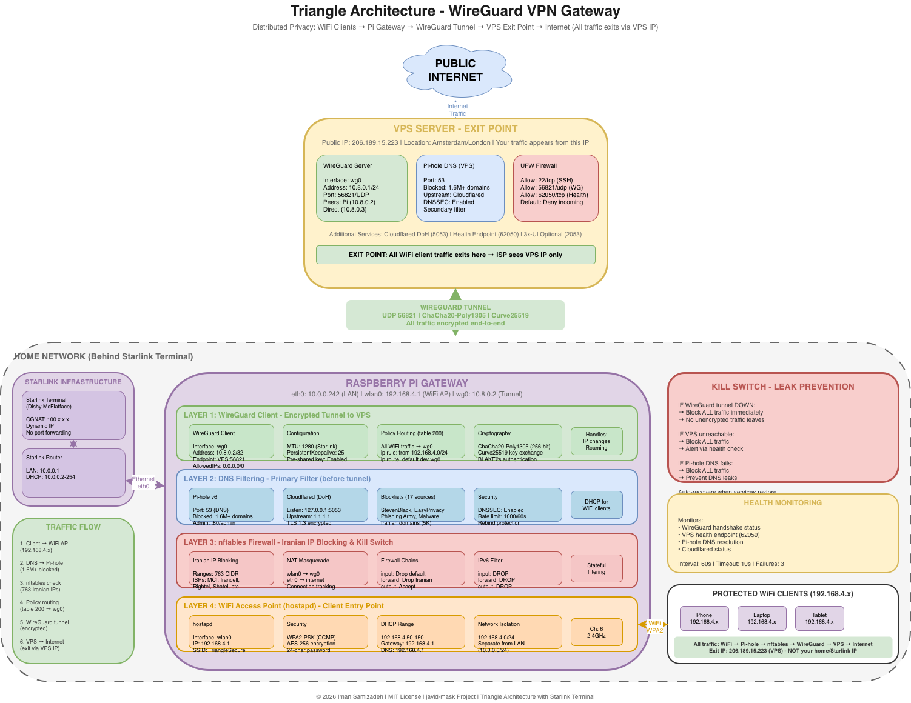
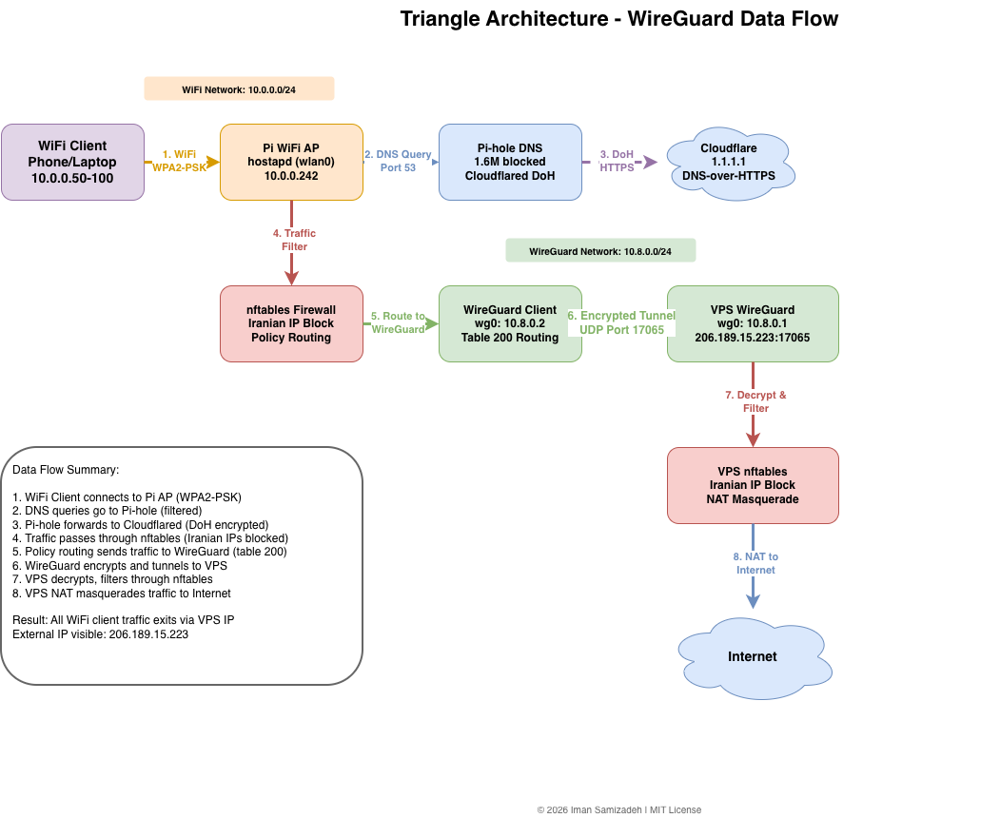
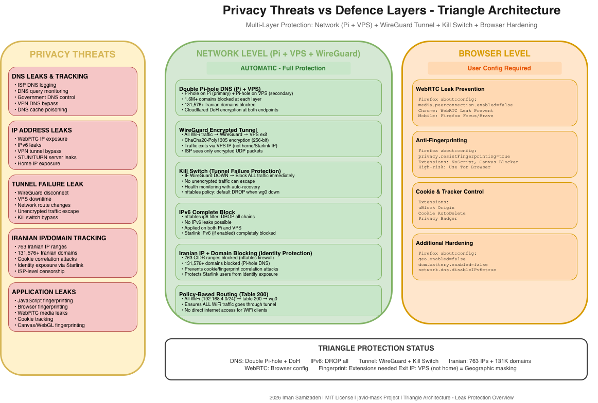

# Triangle Architecture: WireGuard VPN Gateway

**[English](README.md)** | **[فارسی](README.fa.md)**

A distributed privacy infrastructure using WireGuard VPN to route all WiFi client traffic through a VPS. The Raspberry Pi acts as a centralised gateway with DNS filtering, Iranian IP blocking, and WiFi access point, whilst the VPS provides the encrypted tunnel exit point with its own Pi-hole DNS filtering.

**Author:** Iman Samizadeh
**Licence:** MIT
**Repository:** https://github.com/Iman/javid-mask
**Last Updated:** 2026-02-01

---

## Table of Contents

- [Executive Summary](#executive-summary)
- [What is Triangle Architecture](#what-is-triangle-architecture)
- [Security Model](#security-model)
- [Features](#features)
- [Architecture](#architecture)
- [Starlink Integration](#starlink-integration)
- [Prerequisites](#prerequisites)
- [Installation](#installation)
- [Configuration](#configuration)
- [WireGuard Setup](#wireguard-setup)
- [Usage](#usage)
- [Security Hardening](#security-hardening)
- [Troubleshooting](#troubleshooting)
- [Maintenance](#maintenance)
- [Licence](#licence)

---

## Architecture Diagrams

### Network Architecture



### WireGuard Data Flow



### Leak Protection



---

## Executive Summary

The **Triangle Architecture** provides enterprise-grade privacy by distributing security services across two nodes:

1. **VPS Server**: Encrypted tunnel exit point with global IP
2. **Raspberry Pi Gateway**: Local WiFi AP with DNS filtering and firewall

This architecture ensures:

- **All traffic exits via VPS IP** (not your home/Starlink IP)
- **Double DNS filtering** (Pi-hole on both Pi and VPS)
- **WireGuard encryption** for all WiFi client traffic
- **Iranian IP blocking** at the local gateway
- **Kill-switch protection** if VPN fails

This solution is ideal for users requiring maximum privacy, geographic IP masking, and protection from ISP surveillance.

---

## What is Triangle Architecture

### The Three Components

```
                         ┌──────────────────────────────────┐
                         │           INTERNET               │
                         │        (Public Web)              │
                         └───────────────┬──────────────────┘
                                         │
                         ┌───────────────▼──────────────────┐
                         │         VPS SERVER               │
                         │    (Your Exit Point)             │
                         │                                  │
                         │  IP: 206.189.15.223              │
                         │  Location: Amsterdam/London/etc  │
                         │                                  │
                         │  Services:                       │
                         │  • WireGuard Server (wg0)        │
                         │  • Pi-hole DNS (1.6M+ blocks)    │
                         │  • Cloudflared DoH               │
                         │  • 3x-UI (optional)              │
                         │  • Health Endpoint               │
                         │                                  │
                         │  Your traffic appears to         │
                         │  originate from this IP          │
                         └───────────────┬──────────────────┘
                                         │
                              WireGuard Tunnel
                              UDP Port 56821
                              (Encrypted)
                                         │
┌────────────────────────────────────────┼────────────────────────────────────────┐
│                                        │                                         │
│                         ┌──────────────▼──────────────┐                         │
│                         │     STARLINK TERMINAL       │                         │
│                         │     (CGNAT: 100.x.x.x)      │                         │
│                         └──────────────┬──────────────┘                         │
│                                        │                                         │
│                         ┌──────────────▼──────────────┐                         │
│                         │     STARLINK ROUTER         │                         │
│                         │     (10.0.0.1)              │                         │
│                         └──────────────┬──────────────┘                         │
│                                        │                                         │
│     YOUR HOME NETWORK                  │                                         │
│     (10.0.0.0/24)                      │                                         │
│                                        │                                         │
│  ┌─────────────────┐    ┌──────────────▼──────────────┐    ┌─────────────────┐  │
│  │  Other Devices  │    │      RASPBERRY PI           │    │  Other Devices  │  │
│  │  (Unprotected)  │    │      (Gateway)              │    │  (Unprotected)  │  │
│  │  10.0.0.x       │    │                             │    │  10.0.0.x       │  │
│  └─────────────────┘    │  eth0: 10.0.0.242           │    └─────────────────┘  │
│                         │  wlan0: 192.168.4.1         │                         │
│                         │  wg0: 10.8.0.2              │                         │
│                         │                             │                         │
│                         │  Services:                  │                         │
│                         │  • WireGuard Client         │                         │
│                         │  • WiFi AP (hostapd)        │                         │
│                         │  • Pi-hole DNS              │                         │
│                         │  • Cloudflared DoH          │                         │
│                         │  • nftables Firewall        │                         │
│                         │  • Iranian IP Blocking      │                         │
│                         │  • Kill Switch              │                         │
│                         └──────────────┬──────────────┘                         │
│                                        │                                         │
│                              WiFi AP (WPA2-PSK)                                  │
│                              192.168.4.0/24                                      │
│                                        │                                         │
│         ┌──────────────────────────────┼──────────────────────────────┐         │
│         │                              │                              │         │
│         ▼                              ▼                              ▼         │
│  ┌─────────────────┐    ┌─────────────────────────┐    ┌─────────────────┐     │
│  │   MOBILE PHONE  │    │        LAPTOP           │    │     TABLET      │     │
│  │   (Protected)   │    │      (Protected)        │    │   (Protected)   │     │
│  │   192.168.4.x   │    │      192.168.4.x        │    │   192.168.4.x   │     │
│  │                 │    │                         │    │                 │     │
│  │  All traffic    │    │  All traffic            │    │  All traffic    │     │
│  │  → WireGuard    │    │  → WireGuard            │    │  → WireGuard    │     │
│  │  → VPS          │    │  → VPS                  │    │  → VPS          │     │
│  │  → Internet     │    │  → Internet             │    │  → Internet     │     │
│  └─────────────────┘    └─────────────────────────┘    └─────────────────┘     │
│                                                                                  │
└──────────────────────────────────────────────────────────────────────────────────┘
```

### Why Triangle vs Singleton

| Feature | Singleton | Triangle |
|---------|-----------|----------|
| Exit IP | Home IP (Starlink CGNAT) | VPS IP (static, chosen location) |
| ISP Visibility | Encrypted DNS only | Encrypted tunnel (no content visibility) |
| DNS Filtering | Single Pi-hole | Double Pi-hole (Pi + VPS) |
| Latency | Lower (direct) | Higher (+VPS hop) |
| Complexity | Simple | Moderate |
| VPS Required | No | Yes |
| Kill Switch | Not applicable | Available |
| Geographic Masking | No | Yes |

### When to Use Triangle

**Use Triangle When**:

- You need all device traffic to exit via VPS IP (geographic masking)
- ISP surveillance is a primary concern
- You want WireGuard's performance benefits over proxy protocols
- You have a VPS available in a privacy-friendly jurisdiction
- Double DNS filtering provides additional security value
- Kill-switch protection is required

**Use Singleton When**:

- You don't have a VPS or don't want to manage one
- Simplicity is prioritised
- Local DNS filtering is sufficient
- You're comfortable with traffic exiting via home IP

---

## Leak Protection Summary

### Current Protection Against Leaks

| Leak Type | Protection Status | Implementation |
|-----------|-------------------|----------------|
| **DNS Leak** | ✅ Protected | Double Pi-hole (Pi + VPS) → Cloudflared DoH (encrypted) |
| **IPv6 Leak** | ✅ Protected | IPv6 completely disabled at nftables level (DROP all ip6 traffic) |
| **WebRTC Leak** | ⚠️ Browser Config | Requires browser-level mitigation (not network-level) |
| **Iranian Domain Leak** | ✅ Protected | 131,576+ domains blocked at DNS level (bootmortis + liketolivefree) |
| **Iranian IP Leak** | ✅ Protected | 763 CIDR ranges blocked at firewall level |
| **Cookie Correlation** | ✅ Protected | Iranian domains blocked prevents cookie leakage to Iranian servers |
| **Tunnel Failure** | ✅ Protected | Kill switch blocks all traffic if WireGuard fails |

### What's Covered vs What Needs Browser Configuration

```
NETWORK LEVEL (✅ Fully Protected by Triangle):
├── DNS queries → Pi-hole (local) → Pi-hole (VPS) → Cloudflared DoH
├── IPv6 traffic → DROP (nftables ip6 filter)
├── Iranian IPs → DROP (nftables, 763 CIDR ranges)
├── Iranian domains → 0.0.0.0 (Pi-hole, 131,576+ domains)
├── All WiFi traffic → WireGuard tunnel → VPS exit
└── Kill switch → Block if tunnel fails (no unencrypted traffic)

BROWSER LEVEL (⚠️ User must configure):
├── WebRTC → Disable in browser settings
├── JavaScript fingerprinting → Use uBlock Origin, NoScript
├── Canvas fingerprinting → Firefox resistFingerprinting
└── Cookie tracking → Use Cookie AutoDelete extension
```

### Browser Hardening Guide

To achieve complete leak protection, configure your browser:

**Firefox (Recommended)**:

```
about:config settings:
├── media.peerconnection.enabled → false     (Disables WebRTC)
├── media.navigator.enabled → false          (Disables media devices)
├── privacy.resistFingerprinting → true      (Anti-fingerprinting)
├── network.dns.disableIPv6 → true           (Disable IPv6 DNS)
├── geo.enabled → false                      (Disable geolocation)
├── dom.battery.enabled → false              (Disable battery API)
└── privacy.trackingprotection.enabled → true
```

**Recommended Extensions**:

| Extension | Purpose |
|-----------|---------|
| uBlock Origin | Ad/tracker blocking, WebRTC control |
| NoScript | JavaScript control |
| Cookie AutoDelete | Automatic cookie cleanup |
| HTTPS Everywhere | Force HTTPS connections |
| Decentraleyes | Local CDN emulation |

**Chrome/Chromium**:

```
chrome://flags settings:
├── WebRTC IP handling policy → Disable non-proxied UDP
└── Enable: chrome://settings/content/sensors → Block

Extensions:
├── WebRTC Leak Prevent
├── uBlock Origin
└── Cookie AutoDelete
```

**Mobile (Android)**:

- Use **Firefox Focus** or **Brave Browser**
- V2RayNG/Clash: Enable "Block non-proxy connections"
- Disable WebRTC in browser settings

---

## Security Model

### Defence in Depth

The Triangle architecture implements multiple overlapping security layers across two nodes:

```
┌─────────────────────────────────────────────────────────────────────────────────┐
│                              VPS SERVER                                          │
│                                                                                  │
│  ┌────────────────────────────────────────────────────────────────────────────┐ │
│  │ LAYER 6: EXIT POINT                                                        │ │
│  │ • All traffic exits via VPS IP                                             │ │
│  │ • Geographic IP masking                                                    │ │
│  │ • ISP cannot see destination sites                                         │ │
│  └────────────────────────────────────────────────────────────────────────────┘ │
│  ┌────────────────────────────────────────────────────────────────────────────┐ │
│  │ LAYER 5: VPS DNS FILTERING                                                 │ │
│  │ • Pi-hole v6 (1.6M+ domains blocked)                                       │ │
│  │ • Cloudflared DoH (encrypted upstream)                                     │ │
│  │ • DNSSEC validation                                                        │ │
│  └────────────────────────────────────────────────────────────────────────────┘ │
│  ┌────────────────────────────────────────────────────────────────────────────┐ │
│  │ LAYER 4: VPS FIREWALL                                                      │ │
│  │ • UFW/iptables                                                             │ │
│  │ • WireGuard port (UDP 56821)                                               │ │
│  │ • SSH hardening                                                            │ │
│  └────────────────────────────────────────────────────────────────────────────┘ │
└─────────────────────────────────────────────────────────────────────────────────┘
                                      ▲
                                      │ WireGuard Tunnel (Encrypted)
                                      │ ChaCha20-Poly1305, Curve25519
                                      │
┌─────────────────────────────────────┴───────────────────────────────────────────┐
│                           RASPBERRY PI GATEWAY                                   │
│                                                                                  │
│  ┌────────────────────────────────────────────────────────────────────────────┐ │
│  │ LAYER 3: WIREGUARD TUNNEL                                                  │ │
│  │ • All WiFi traffic encrypted to VPS                                        │ │
│  │ • Policy-based routing (table 200)                                         │ │
│  │ • Kill switch (blocks traffic if tunnel fails)                             │ │
│  └────────────────────────────────────────────────────────────────────────────┘ │
│  ┌────────────────────────────────────────────────────────────────────────────┐ │
│  │ LAYER 2: LOCAL FIREWALL                                                    │ │
│  │ • nftables with Iranian IP blocking (763 ranges)                           │ │
│  │ • Stateful connection tracking                                             │ │
│  │ • NAT masquerading                                                         │ │
│  └────────────────────────────────────────────────────────────────────────────┘ │
│  ┌────────────────────────────────────────────────────────────────────────────┐ │
│  │ LAYER 1: LOCAL DNS FILTERING                                               │ │
│  │ • Pi-hole v6 (1.6M+ domains blocked)                                       │ │
│  │ • Cloudflared DoH (encrypted upstream)                                     │ │
│  │ • DNSSEC validation                                                        │ │
│  └────────────────────────────────────────────────────────────────────────────┘ │
│  ┌────────────────────────────────────────────────────────────────────────────┐ │
│  │ LAYER 0: PHYSICAL ACCESS                                                   │ │
│  │ • WPA2-PSK (CCMP) WiFi encryption                                          │ │
│  │ • Network isolation (192.168.4.0/24)                                       │ │
│  │ • Dedicated subnet for protected devices                                   │ │
│  └────────────────────────────────────────────────────────────────────────────┘ │
└─────────────────────────────────────────────────────────────────────────────────┘
```

### Trust Boundaries

| Component | Trust Level | Data Exposed | Mitigation |
|-----------|-------------|--------------|------------|
| VPS Server | High | Decrypted traffic | Choose reputable provider, encrypt sensitive data |
| Raspberry Pi | Full | All local traffic | Physical security, SSH keys |
| WireGuard Tunnel | Full | Encrypted blobs | Modern cryptography (ChaCha20-Poly1305) |
| Cloudflare DNS | Partial | Domain queries | DoH encryption, privacy policy |
| Starlink/ISP | Untrusted | Encrypted tunnel only | WireGuard encryption |
| WiFi Clients | Untrusted | Own traffic only | Network isolation |

### Cryptographic Standards

| Function | Algorithm | Key Size | Standard |
|----------|-----------|----------|----------|
| WireGuard Tunnel | ChaCha20-Poly1305 | 256-bit | RFC 8439 |
| WireGuard Key Exchange | Curve25519 | 256-bit | RFC 7748 |
| WireGuard Authentication | BLAKE2s | 256-bit | RFC 7693 |
| WiFi Encryption | AES-CCMP | 256-bit | WPA2-PSK |
| DNS-over-HTTPS | TLS 1.3 | 256-bit | RFC 8484 |
| DNSSEC | RSA/ECDSA | 2048/256-bit | RFC 4033-4035 |

### Kill Switch Implementation

The kill switch ensures no traffic leaks if the WireGuard tunnel fails:

```nft
# Kill switch rules in nftables
table inet filter {
    chain output {
        type filter hook output priority filter; policy drop;

        # Allow loopback
        oifname "lo" accept

        # Allow WireGuard establishment to VPS
        ip daddr 206.189.15.223 udp dport 56821 accept

        # Allow traffic through WireGuard tunnel only
        oifname "wg0" accept

        # Allow DHCP
        udp dport 67 accept
        udp sport 68 accept

        # Drop everything else (kill switch)
        counter drop comment "Kill switch: block non-tunnel traffic"
    }
}
```

---

## Features

### VPS Server

- **WireGuard Server**: High-performance VPN tunnel with modern cryptography
- **Pi-hole DNS Filtering**: 1.6M+ domains blocked including 131,576+ Iranian domains (secondary filter)
- **DNS-over-HTTPS**: Cloudflared encrypts upstream DNS queries
- **Comprehensive Blocklists**: Ads, trackers, malware, phishing, Iranian domains
- **Health Endpoint**: HTTP monitoring endpoint (port 62050)
- **3x-UI (Optional)**: Web-based Xray management for additional protocols
- **UFW Firewall**: Strict firewall with minimal open ports

### Raspberry Pi Gateway

- **WireGuard Client**: Encrypted tunnel to VPS with pre-shared key
- **Policy-Based Routing**: All WiFi traffic through WireGuard (table 200)
- **Pi-hole DNS Filtering**: Local DNS with 1.6M+ blocks (primary filter)
- **DNS-over-HTTPS**: Cloudflared for encrypted upstream DNS
- **WiFi Access Point**: WPA2-PSK encrypted AP (hostapd)
- **Iranian IP Blocking**: 763 CIDR ranges blocked (nftables)
- **NAT Masquerade**: Seamless routing for WiFi clients
- **Kill Switch**: Blocks all traffic if WireGuard tunnel fails
- **Health Monitoring**: Automatic tunnel recovery

### Network Security Features

| Feature | Location | Description |
|---------|----------|-------------|
| Double DNS Filtering | Pi + VPS | Two layers of domain blocking |
| WireGuard Encryption | Tunnel | All traffic encrypted end-to-end |
| Iranian IP Blocking | Pi | 763 CIDR ranges blocked locally |
| Stateful Firewall | Both | Connection tracking on both nodes |
| Kill Switch | Pi | Blocks traffic if tunnel fails |
| DoH Encryption | Both | DNS queries encrypted to Cloudflare |
| DNSSEC Validation | Both | Cryptographic DNS verification |

### Blocklists Included

| Category | Source | Domains | Updated |
|----------|--------|---------|---------|
| Unified Hosts | StevenBlack/hosts | 150,000+ | Daily |
| Privacy | EasyPrivacy | 25,000+ | Weekly |
| Advertising | Prigent-Ads | 50,000+ | Daily |
| Phishing | Phishing Army | 30,000+ | Hourly |
| Malware | Malware Domains | 20,000+ | Daily |
| Tracking | BlocklistProject | 100,000+ | Daily |
| YouTube Ads | kboghdady | 5,000+ | Weekly |
| Crypto Miners | CoinBlockerLists | 10,000+ | Daily |
| Iranian Domains | bootmortis/iran-hosted-domains | 131,576+ | Weekly |

---

## Architecture

### Network Topology with Starlink

```
┌─────────────────────────────────────────────────────────────────────────────────┐
│                              INTERNET                                            │
└───────────────────────────────────────┬─────────────────────────────────────────┘
                                        │
                    ┌───────────────────┴───────────────────┐
                    │                                       │
        ┌───────────▼───────────┐           ┌───────────────▼───────────────┐
        │   STARLINK GATEWAY    │           │         VPS SERVER            │
        │   (Space & Ground)    │           │   (DigitalOcean/Vultr/etc)    │
        │                       │           │                               │
        │   • LEO Satellites    │           │   IP: 206.189.15.223          │
        │   • Ground Stations   │           │   Location: Amsterdam         │
        │   • CGNAT (100.x.x.x) │           │                               │
        └───────────┬───────────┘           │   ┌───────────────────────┐   │
                    │                       │   │ eth0: Public IP       │   │
        ┌───────────▼───────────┐           │   │ wg0: 10.8.0.1/24     │   │
        │  STARLINK TERMINAL    │           │   └───────────────────────┘   │
        │  (Dishy McFlatface)   │           │                               │
        │                       │           │   Services:                   │
        │  CGNAT IP: 100.x.x.x  │           │   • WireGuard (UDP 56821)    │
        │  Latency: 20-100ms    │           │   • Pi-hole (53, 80)         │
        └───────────┬───────────┘           │   • Cloudflared (5053)       │
                    │                       │   • Health (62050)           │
        ┌───────────▼───────────┐           │   • SSH (22)                 │
        │   STARLINK ROUTER     │           │                               │
        │   (or Bypass Mode)    │           │   Firewall (UFW):            │
        │                       │           │   • 22/tcp (SSH)             │
        │   LAN: 10.0.0.1       │           │   • 56821/udp (WireGuard)    │
        │   DHCP: 10.0.0.2-254  │           │   • 62050/tcp (Health)       │
        └───────────┬───────────┘           │                               │
                    │                       └───────────────┬───────────────┘
                    │                                       │
                    │         WireGuard Tunnel              │
                    │         UDP 56821                     │
                    │         Encrypted (ChaCha20)          │
                    │                                       │
        ┌───────────▼───────────────────────────────────────┴───────────────┐
        │                                                                    │
        │                        HOME NETWORK                                │
        │                        10.0.0.0/24                                 │
        │                                                                    │
        │   ┌────────────────────────────────────────────────────────────┐  │
        │   │                    RASPBERRY PI                             │  │
        │   │                    (Gateway)                                │  │
        │   │                                                             │  │
        │   │   Network Interfaces:                                       │  │
        │   │   ┌─────────────┬─────────────┬─────────────┐              │  │
        │   │   │ eth0        │ wlan0       │ wg0         │              │  │
        │   │   │ 10.0.0.242  │ 192.168.4.1 │ 10.8.0.2    │              │  │
        │   │   │ (LAN)       │ (WiFi AP)   │ (Tunnel)    │              │  │
        │   │   └─────────────┴─────────────┴─────────────┘              │  │
        │   │                                                             │  │
        │   │   Security Stack:                                           │  │
        │   │   ┌─────────────────────────────────────────────────────┐  │  │
        │   │   │ hostapd          WiFi AP (WPA2-PSK, CCMP)           │  │  │
        │   │   ├─────────────────────────────────────────────────────┤  │  │
        │   │   │ Pi-hole          DNS Filter (1.6M+ blocks)          │  │  │
        │   │   ├─────────────────────────────────────────────────────┤  │  │
        │   │   │ Cloudflared      DNS-over-HTTPS (Cloudflare)        │  │  │
        │   │   ├─────────────────────────────────────────────────────┤  │  │
        │   │   │ nftables         Firewall + Iranian IP (763)        │  │  │
        │   │   ├─────────────────────────────────────────────────────┤  │  │
        │   │   │ WireGuard        VPN Client (to VPS)                │  │  │
        │   │   ├─────────────────────────────────────────────────────┤  │  │
        │   │   │ Health Check     Kill Switch + Monitoring           │  │  │
        │   │   └─────────────────────────────────────────────────────┘  │  │
        │   │                                                             │  │
        │   │   Traffic Flow:                                             │  │
        │   │   WiFi Client → Pi-hole → nftables → wg0 → VPS → Internet  │  │
        │   │                                                             │  │
        │   └─────────────────────────────────────────────────────────────┘  │
        │                           │                                        │
        │                    WiFi AP (WPA2-PSK)                              │
        │                    SSID: TriangleSecure-XXXXXXXX                   │
        │                    Network: 192.168.4.0/24                         │
        │                           │                                        │
        │      ┌────────────────────┼────────────────────┐                  │
        │      │                    │                    │                  │
        │      ▼                    ▼                    ▼                  │
        │  ┌────────┐          ┌────────┐          ┌────────┐              │
        │  │ Phone  │          │ Laptop │          │ Tablet │              │
        │  │ .4.51  │          │ .4.52  │          │ .4.53  │              │
        │  └────────┘          └────────┘          └────────┘              │
        │                                                                    │
        │  All devices:                                                      │
        │  • DNS via Pi-hole (filtered)                                      │
        │  • Traffic via WireGuard (encrypted)                               │
        │  • Exit via VPS IP (206.189.15.223)                               │
        │                                                                    │
        └────────────────────────────────────────────────────────────────────┘
```

### Traffic Flow Detail

**DNS Resolution**:

```
┌──────────────┐    ┌───────────────────┐    ┌──────────────────┐    ┌────────────┐
│ WiFi Client  │───▶│ Pi-hole (Local)   │───▶│ Cloudflared      │───▶│ Cloudflare │
│ 192.168.4.x  │    │ 192.168.4.1:53    │    │ 127.0.0.1:5053   │    │ 1.1.1.1    │
└──────────────┘    │                   │    │                  │    │            │
                    │ Check blocklist   │    │ Encrypt with TLS │    │ DoH Query  │
                    │ (1.6M+ domains)   │    │ Send via HTTPS   │    │            │
                    │                   │    │                  │    │            │
                    │ If blocked:       │    │                  │    │            │
                    │ Return 0.0.0.0    │    │                  │    │            │
                    └───────────────────┘    └──────────────────┘    └────────────┘
```

**Data Traffic**:

```
┌──────────────┐    ┌───────────────────┐    ┌──────────────────┐    ┌────────────┐
│ WiFi Client  │───▶│ nftables          │───▶│ WireGuard        │───▶│ VPS        │
│ 192.168.4.x  │    │ (Raspberry Pi)    │    │ Tunnel (wg0)     │    │ Server     │
└──────────────┘    │                   │    │                  │    │            │
                    │ 1. Check Iranian  │    │ 1. Encrypt with  │    │ 1. Decrypt │
                    │    blocklist      │    │    ChaCha20      │    │ 2. Pi-hole │
                    │ 2. Drop if match  │    │ 2. Send to VPS   │    │    filter  │
                    │ 3. NAT masquerade │    │    UDP 56821     │    │ 3. Forward │
                    │ 4. Forward to wg0 │    │                  │    │    to net  │
                    └───────────────────┘    └──────────────────┘    └────────────┘
```

**Policy Routing (Table 200)**:

```bash
# Traffic from WiFi clients uses table 200
ip rule add from 192.168.4.0/24 table 200 priority 100

# Table 200 routes everything through WireGuard
ip route add default dev wg0 table 200

# Pi itself can still reach local network
ip rule add from 10.0.0.242 table main priority 50
```

### Active Services

**VPS Server**:

| Service | Port | Protocol | Function |
|---------|------|----------|----------|
| WireGuard | 56821 | UDP | VPN tunnel server |
| Pi-hole | 53 | UDP/TCP | DNS filtering |
| Pi-hole | 80 | HTTP | Web admin |
| Cloudflared | 5053 | DoH | DNS-over-HTTPS |
| Health | 62050 | HTTP | Monitoring endpoint |
| SSH | 22 | TCP | Remote management |
| 3x-UI | 2053 | HTTPS | Xray management (optional) |

**Raspberry Pi**:

| Service | Port | Protocol | Function |
|---------|------|----------|----------|
| hostapd | - | 802.11 | WiFi AP |
| Pi-hole | 53 | UDP/TCP | DNS filtering |
| Pi-hole | 80 | HTTP | Web admin |
| Cloudflared | 5053 | DoH | DNS-over-HTTPS |
| WireGuard | - | - | VPN client |
| nftables | - | - | Firewall |
| Health Check | - | - | Monitoring |

---

## Starlink Integration

### Starlink Network Characteristics

**Understanding Starlink for VPN Use**:

| Characteristic | Impact | Triangle Handling |
|----------------|--------|-------------------|
| CGNAT (100.x.x.x) | No port forwarding | VPS initiates no connections to home |
| Dynamic IP | IP changes frequently | WireGuard handles roaming |
| Variable Latency | 20-100ms typical | WireGuard designed for this |
| No IPv6 (currently) | IPv4 only | IPv6 disabled in config |
| Packet Loss | Occasional drops | WireGuard handles retransmission |
| Bandwidth | 50-200+ Mbps | Sufficient for most use |

**Why Triangle Works Well with Starlink**:

1. **Outbound Only**: WireGuard client initiates connection (no port forwarding needed)
2. **UDP Protocol**: WireGuard uses UDP (better for satellite)
3. **Built-in Roaming**: WireGuard handles IP changes automatically
4. **Efficient Protocol**: Minimal overhead for satellite bandwidth

### Starlink-Specific Configuration

**WireGuard Configuration for Starlink**:

```ini
# /etc/wireguard/wg0.conf (on Raspberry Pi)

[Interface]
PrivateKey = <pi-private-key>
Address = 10.8.0.2/32
DNS = 1.1.1.1, 1.0.0.1
# Reduced MTU for satellite overhead
MTU = 1280

[Peer]
PublicKey = <vps-public-key>
PresharedKey = <preshared-key>
AllowedIPs = 0.0.0.0/0
Endpoint = 206.189.15.223:56821
# Keepalive for NAT traversal (important for CGNAT)
PersistentKeepalive = 25
```

**Why These Settings**:

| Setting | Value | Reason |
|---------|-------|--------|
| MTU | 1280 | Conservative for satellite encapsulation |
| PersistentKeepalive | 25 | Maintains NAT mapping through CGNAT |
| DNS | 1.1.1.1 | Fallback if Pi-hole unavailable |

### Network Configuration for Starlink Router

**Recommended Starlink Router Settings**:

```
Starlink Router Configuration:
├── DHCP: Enabled
│   └── Reserve 10.0.0.242 for Raspberry Pi MAC
├── DNS: Leave default (clients use Pi-hole anyway)
├── IPv6: Disable if available
└── UPnP: Can disable (not needed)
```

**Alternative: Bypass Mode**:

For advanced users, Starlink bypass mode provides more control:

```
Starlink Terminal (Bridge Mode)
    │
    └── Your Router (10.0.0.1)
        ├── Full DHCP/DNS control
        ├── Better QoS options
        ├── Static routing capability
        └── Pi: 10.0.0.242
```

---

## Prerequisites

### Hardware Requirements

**VPS Server**:

| Requirement | Minimum | Recommended |
|-------------|---------|-------------|
| RAM | 512MB | 1GB+ |
| Storage | 10GB | 20GB |
| Bandwidth | 500GB/month | Unmetered |
| Location | Any | Privacy-friendly (NL, CH, IS) |
| IPv4 | Required | Static IP |
| OS | Debian 11+ | Debian 12/Ubuntu 22.04 |

**Raspberry Pi**:

| Requirement | Minimum | Recommended |
|-------------|---------|-------------|
| Model | Pi 3B+ | Pi 5 (4GB) |
| Storage | 16GB microSD | 32GB A2 microSD |
| WiFi | Built-in | Built-in or USB 5GHz |
| Ethernet | 100Mbps | Gigabit |
| Power | 5V 2.5A | 5V 5A (Pi 5) |

### Software Requirements

**Control Machine** (your laptop):

- Ansible 2.9+ (`brew install ansible` or `pip install ansible`)
- SSH client with key authentication
- Python 3.8+
- Git

**VPS**:

- Fresh Debian 12/13 or Ubuntu 22.04/24.04
- Root SSH access
- Ports available: 22, 56821/UDP, 62050

**Raspberry Pi**:

- Raspberry Pi OS (Debian 13 "Trixie")
- SSH enabled with user account
- Sudo privileges
- Ethernet connection to Starlink router

### Network Requirements

| Requirement | VPS | Raspberry Pi |
|-------------|-----|--------------|
| Public IP | Yes (static) | No |
| Port Forwarding | 56821/UDP | Not needed |
| Internet | Required | Via Starlink |
| Bandwidth | Sufficient for clients | Starlink speeds |

---

## Installation

### Step 1: Prepare VPS

```bash
# SSH to VPS
ssh root@206.189.15.223

# Update system
apt update && apt upgrade -y

# Install prerequisites
apt install curl wget git python3 python3-pip -y

# Verify
python3 --version
```

### Step 2: Prepare Raspberry Pi

```bash
# Flash Raspberry Pi OS using Raspberry Pi Imager
# Enable SSH in imager, create user 'admin'
# Connect Ethernet to Starlink router
# Boot Pi and find IP (check router DHCP leases)

# SSH to Pi
ssh admin@10.0.0.242

# Update system
sudo apt update && sudo apt upgrade -y

# Install prerequisites
sudo apt install python3 python3-pip -y
```

### Step 3: Install Ansible (Control Machine)

```bash
# macOS
brew install ansible

# Ubuntu/Debian
sudo apt install ansible sshpass -y

# Verify
ansible --version
```

### Step 4: Clone Repository

```bash
git clone https://github.com/Iman/javid-mask.git
cd javid-mask/triangle/ansible
```

### Step 5: Configure Inventory

Edit `inventory.yml`:

```yaml
all:
  children:
    proxy_server:
      hosts:
        vps:
          ansible_host: 206.189.15.223
          ansible_user: root
          ansible_python_interpreter: /usr/bin/python3

    local_gateway:
      hosts:
        raspberry_pi:
          ansible_host: 10.0.0.242
          ansible_user: admin
          ansible_become: yes
          ansible_python_interpreter: /usr/bin/python3
```

### Step 6: Configure Variables

Edit `group_vars/all.yml`:

```yaml
# VPS Configuration
vps_ip: 206.189.15.223
vps_hostname: javid-proxy-vps

# WireGuard Configuration
wireguard_enabled: true
wireguard_port: 56821
wireguard_network: "10.8.0.0/24"
wireguard_server_address: "10.8.0.1/24"
wireguard_pi_address: "10.8.0.2/32"
wireguard_mtu: 1280                    # Conservative for Starlink

# Generate keys with: wg genkey | tee privatekey | wg pubkey > publickey
# Generate PSK with: wg genpsk
wireguard_server_private_key: "<generate-new-key>"
wireguard_server_public_key: "<derive-from-private>"
wireguard_pi_private_key: "<generate-new-key>"
wireguard_pi_public_key: "<derive-from-private>"
wireguard_pi_preshared_key: "<generate-new-psk>"

# WiFi Settings
wifi_ssid: "TriangleSecure"
wifi_password: "YourSecurePassword"
wifi_channel: 6
wifi_country_code: GB

# WiFi Network (isolated subnet)
wifi_network: 192.168.4.0/24
wifi_gateway: 192.168.4.1
dhcp_range_start: 192.168.4.50
dhcp_range_end: 192.168.4.150

# Security Features
block_iranian_ips: true
kill_switch_enabled: true
health_check_enabled: true
```

### Step 7: Generate WireGuard Keys

```bash
# Generate server keys
wg genkey | tee server_private.key | wg pubkey > server_public.key

# Generate Pi keys
wg genkey | tee pi_private.key | wg pubkey > pi_public.key

# Generate pre-shared key
wg genpsk > preshared.key

# Add to group_vars/all.yml
cat server_private.key   # wireguard_server_private_key
cat server_public.key    # wireguard_server_public_key
cat pi_private.key       # wireguard_pi_private_key
cat pi_public.key        # wireguard_pi_public_key
cat preshared.key        # wireguard_pi_preshared_key

# Securely delete key files
shred -u *.key
```

### Step 8: Deploy

```bash
# Test connectivity
ansible all -i inventory.yml -m ping

# Deploy VPS first
ansible-playbook -i inventory.yml playbook.yml --limit proxy_server

# Deploy Pi
ansible-playbook -i inventory.yml playbook.yml --limit local_gateway

# Or deploy all at once
ansible-playbook -i inventory.yml playbook.yml
```

### Step 9: Verify Deployment

```bash
# Check VPS WireGuard
ssh root@206.189.15.223 "wg show"

# Check Pi WireGuard
ssh admin@10.0.0.242 "sudo wg show"

# Verify tunnel
ssh admin@10.0.0.242 "ping -c 3 10.8.0.1"
```

---

## Configuration

### VPS Services

| Service | Port | Function | Configuration |
|---------|------|----------|---------------|
| WireGuard | 56821/UDP | VPN tunnel | /etc/wireguard/wg0.conf |
| Pi-hole | 53 | DNS filtering | /etc/pihole/setupVars.conf |
| Pi-hole | 80 | Web admin | http://VPS_IP/admin |
| Cloudflared | 5053 | DNS-over-HTTPS | /etc/cloudflared/config.yml |
| Health | 62050 | Monitoring | /opt/health-endpoint/ |
| UFW | - | Firewall | ufw status |

### Pi Services

| Service | Port | Function | Configuration |
|---------|------|----------|---------------|
| hostapd | - | WiFi AP | /etc/hostapd/hostapd.conf |
| Pi-hole | 53 | DNS filtering | /etc/pihole/setupVars.conf |
| Cloudflared | 5053 | DNS-over-HTTPS | /etc/cloudflared/config.yml |
| WireGuard | - | VPN client | /etc/wireguard/wg0.conf |
| nftables | - | Firewall | /etc/nftables.conf |
| Health Check | - | Monitoring | /opt/health-check/ |

### Firewall Rules (Pi)

```nft
#!/usr/sbin/nft -f

flush ruleset

table inet filter {
    set iranian_blocklist {
        type ipv4_addr
        flags interval
        auto-merge
        elements = {
            2.144.0.0/14,
            5.52.0.0/15,
            ... (763 ranges)
        }
    }

    chain input {
        type filter hook input priority filter; policy drop;
        ct state established,related accept
        iifname "lo" accept
        iifname "wlan0" accept
        iifname "wg0" accept
        ip saddr @iranian_blocklist counter drop
    }

    chain forward {
        type filter hook forward priority filter; policy drop;
        ct state established,related accept
        iifname "wg0" accept
        oifname "wg0" accept
        ip saddr @iranian_blocklist counter drop
        ip daddr @iranian_blocklist counter drop
        iifname "wlan0" oifname "wg0" accept
    }

    chain output {
        type filter hook output priority filter; policy accept;
        ip daddr @iranian_blocklist counter drop
    }
}

table ip nat {
    chain postrouting {
        type nat hook postrouting priority srcnat; policy accept;
        oifname "wg0" masquerade
        oifname "eth0" masquerade
    }
}
```

---

## Usage

### Connect to WiFi

1. Find SSID: `TriangleSecure-XXXXXXXX`
2. Enter password from `credentials.txt`
3. All traffic automatically routes through VPS

### Verify VPN Connection

```bash
# Check external IP (should show VPS IP)
curl https://ifconfig.me
# Expected: 206.189.15.223

# DNS leak test
# Visit: https://dnsleaktest.com
# Should show Cloudflare DNS only
```

### Access Admin Panels

| Panel | URL | Credentials |
|-------|-----|-------------|
| VPS Pi-hole | http://206.189.15.223/admin | From credentials.txt |
| Pi Pi-hole | http://192.168.4.1/admin | From credentials.txt |
| VPS 3x-UI | http://206.189.15.223:2053/ | admin/admin (change!) |

### WireGuard Direct Client

For devices connecting directly to VPS (bypassing Pi):

```ini
# wireguard-direct-client.conf
[Interface]
PrivateKey = <direct_private_key>
Address = 10.8.0.3/32
DNS = 10.8.0.1

[Peer]
PublicKey = <server_public_key>
PresharedKey = <direct_preshared_key>
AllowedIPs = 0.0.0.0/0
Endpoint = 206.189.15.223:56821
PersistentKeepalive = 25
```

---

## Security Hardening

### VPS Hardening

```bash
# SSH hardening
cat >> /etc/ssh/sshd_config << 'EOF'
PasswordAuthentication no
PermitRootLogin prohibit-password
MaxAuthTries 3
ClientRezaveInterval 300
EOF

systemctl restart sshd

# UFW configuration
ufw default deny incoming
ufw default allow outgoing
ufw allow 22/tcp
ufw allow 56821/udp
ufw allow 62050/tcp
ufw enable
```

### Pi Hardening

```bash
# Disable password auth
sudo sed -i 's/PasswordAuthentication yes/PasswordAuthentication no/' /etc/ssh/sshd_config
sudo systemctl restart sshd

# Automatic security updates
sudo apt install unattended-upgrades -y
sudo dpkg-reconfigure -plow unattended-upgrades
```

### Key Rotation

Rotate WireGuard keys periodically:

```bash
# Generate new keys
wg genkey | tee new_private.key | wg pubkey > new_public.key

# Update group_vars/all.yml with new keys
# Redeploy
ansible-playbook -i inventory.yml playbook.yml --tags wireguard
```

---

## Troubleshooting

### WireGuard Not Connecting

```bash
# Check Pi WireGuard status
sudo wg show wg0

# If no handshake, verify:
# 1. VPS firewall allows UDP 56821
ssh root@206.189.15.223 "ufw status | grep 56821"

# 2. Keys match
# Compare public keys in configs

# 3. Endpoint correct
cat /etc/wireguard/wg0.conf | grep Endpoint

# Restart WireGuard
sudo systemctl restart wg-quick@wg0
```

### No Internet on WiFi Clients

```bash
# Check IP forwarding
cat /proc/sys/net/ipv4/ip_forward  # Should be 1

# Check policy routing
ip rule show
ip route show table 200

# Check NAT
sudo nft list table ip nat

# Verify tunnel
ping -c 3 10.8.0.1
```

### DNS Not Resolving

```bash
# Test Pi-hole
nslookup google.com 192.168.4.1

# Test Cloudflared
nslookup google.com 127.0.0.1#5053

# Check services
sudo systemctl status pihole-FTL
sudo systemctl status cloudflared
```

### Kill Switch Activated

If internet stops but WiFi works:

```bash
# Check WireGuard status
sudo wg show wg0

# Check health logs
sudo journalctl -u health-check -f

# Manual tunnel restart
sudo systemctl restart wg-quick@wg0
```

---

## Maintenance

### Update Systems

```bash
# VPS
ssh root@206.189.15.223
apt update && apt upgrade -y
pihole -up

# Pi
ssh admin@10.0.0.242
sudo apt update && sudo apt upgrade -y
pihole -up
```

### Update Blocklists

```bash
# On both VPS and Pi
pihole -g
```

### Redeploy

```bash
# Full redeploy
ansible-playbook -i inventory.yml playbook.yml

# Specific roles
ansible-playbook -i inventory.yml playbook.yml --tags pi-wireguard
ansible-playbook -i inventory.yml playbook.yml --tags pi-firewall
ansible-playbook -i inventory.yml playbook.yml --tags vps-pihole
```

### View Logs

```bash
# VPS
journalctl -u wg-quick@wg0 -f
journalctl -u pihole-FTL -f

# Pi
sudo journalctl -u wg-quick@wg0 -f
sudo journalctl -u pihole-FTL -f
sudo journalctl -u hostapd -f
sudo journalctl -u health-check -f
```

---

## Directory Structure

```
triangle/
├── ansible/
│   ├── inventory.yml               # Host configuration
│   ├── playbook.yml                # Main playbook (two plays)
│   ├── group_vars/
│   │   └── all.yml                 # Central configuration
│   ├── files/
│   │   ├── iranian-ips.txt         # 763 Iranian IP ranges
│   │   └── blocklists/             # DNS blocklists
│   └── roles/
│       ├── vps-prerequisites/      # VPS system setup
│       ├── vps-wireguard/          # WireGuard server
│       ├── vps-pihole/             # VPS Pi-hole
│       ├── vps-cloudflared/        # VPS DoH
│       ├── vps-firewall/           # VPS UFW
│       ├── vps-health-endpoint/    # Monitoring
│       ├── vps-3x-ui/              # Optional Xray
│       ├── pi-prerequisites/       # Pi system setup
│       ├── pi-network/             # Network config
│       ├── pi-hostapd/             # WiFi AP
│       ├── pi-pihole/              # Pi Pi-hole
│       ├── pi-wireguard/           # WireGuard client
│       ├── pi-firewall/            # nftables
│       └── pi-health-check/        # Kill switch
├── diagrams/
│   ├── triangle-architecture.drawio
│   ├── network-architecture.drawio
│   └── wireguard-data-flow.drawio
├── wireguard-pi-client.conf        # Generated Pi config
├── wireguard-direct-client.conf    # Generated direct config
├── credentials.txt                 # Generated credentials
├── README.md                       # This file
├── README.fa.md                    # Persian documentation
└── LICENSE                         # MIT licence
```

---

## Security Considerations

### What Triangle Protects Against

| Threat | Protection |
|--------|------------|
| ISP surveillance | All traffic encrypted via WireGuard |
| IP-based tracking | Traffic exits via VPS IP |
| DNS leaks | Double Pi-hole + DoH |
| Iranian IP tracking | 763 CIDR ranges blocked |
| Iranian domain correlation | 131,576+ domains blocked (identity protection) |
| Tunnel failure | Kill switch blocks unencrypted traffic |
| Man-in-the-middle | WireGuard authentication |

### Identity Correlation Attack Prevention

**The Starlink Identity Exposure Threat**:

When a user with Starlink (foreign IP) accidentally visits an Iranian website, their identity can be correlated through cookies, browser fingerprints, or login sessions:

```
SCENARIO: User with existing Iranian cookies connects via Starlink

Iranian Server sees:
├── Cookie: user=Reza (same as before)
├── IP: 206.189.15.223 (VPS - foreign!)
└── Conclusion: "Reza is using foreign internet access"
```

**Triangle's Multi-Layer Defence**:

1. **DNS Layer (Pi-hole)**: Blocks 131,576+ Iranian domains at DNS level
2. **IP Layer (nftables)**: Blocks 763 Iranian IP ranges
3. **Exit Layer (VPS)**: All traffic exits via VPS, not home IP

**Iranian Domain Sources**:

| Source | Domains | Description |
|--------|---------|-------------|
| bootmortis/iran-hosted-domains | 131,576+ | Comprehensive Iranian domain registry |
| liketolivefree/iran_domain-ip | ~50,000 | Additional Iranian domains |
| **Combined** | ~180,000 | Total unique domains blocked |

**Test the Protection**:

```bash
# From WiFi client - should return 0.0.0.0 (blocked)
nslookup digikala.com
nslookup snapp.ir
nslookup aparat.com

# Should work normally (allowed)
nslookup google.com
```

### What Triangle Does NOT Protect Against

| Threat | Reason | Mitigation |
|--------|--------|------------|
| VPS provider access | They control the server | Choose reputable provider |
| Endpoint compromise | Malware on devices | Endpoint security |
| Traffic analysis | Timing patterns visible | Tor for high-risk |
| Browser fingerprinting | JS-based tracking | Tor Browser |

---

## MikroTik vs Raspberry Pi Comparison

### Why Raspberry Pi Instead of MikroTik?

| Feature | MikroTik | Raspberry Pi (Triangle) |
|---------|----------|-------------------------|
| Iranian IP Blocking | ✅ Yes (address lists + firewall) | ✅ Yes (nftables, 763 ranges) |
| WireGuard VPN | ✅ Yes (RouterOS 7+) | ✅ Yes |
| WiFi Access Point | ✅ Yes | ✅ Yes (hostapd) |
| NAT/Routing | ✅ Yes | ✅ Yes |
| IPv6 Blocking | ✅ Yes | ✅ Yes |
| Policy Routing | ✅ Yes | ✅ Yes |
| DNS Filtering (1.6M+ domains) | ❌ Limited | ✅ Yes (Pi-hole on Pi + VPS) |
| Iranian Domain Blocking (131K+) | ❌ Impractical | ✅ Yes (Pi-hole) |
| DNS-over-HTTPS | ⚠️ Limited (RouterOS 7.1+) | ✅ Full (Cloudflared) |
| VLESS/VMess/Reality Proxy | ❌ No | ✅ Yes (3x-UI/Xray) |
| Web Dashboard for DNS | ❌ No | ✅ Yes (Pi-hole admin) |
| Automatic Blocklist Updates | ❌ Manual | ✅ Automatic (cron) |
| Kill Switch | ✅ Yes (with scripting) | ✅ Yes (nftables + health check) |
| Double DNS Filtering | ❌ No | ✅ Yes (Pi + VPS) |

### What MikroTik CAN Do

```
MikroTik Capabilities (RouterOS 7+):
├── ✅ WireGuard tunnel to VPS
├── ✅ Iranian IP blocking (763 CIDR ranges via address lists)
├── ✅ Kill switch (policy routing + firewall)
├── ✅ IPv6 DROP
├── ✅ NAT masquerade
└── ✅ WiFi AP with WPA2
```

### What MikroTik CANNOT Do Well

```
MikroTik Limitations:
├── ❌ DNS blocklists (address list limit ~65K practical)
│   └── Cannot handle 1.6M domains + 131K Iranian domains
├── ❌ DNS-over-HTTPS (basic, not flexible)
├── ❌ VLESS/VMess/Reality protocols
├── ❌ Pi-hole style web dashboard
├── ❌ Double DNS filtering (Pi + VPS)
└── ❌ Easy blocklist management
```

### Recommendation: Hybrid Setup

For maximum protection, consider using MikroTik + Raspberry Pi together:

```
Option 1: MikroTik as WireGuard endpoint
Internet → MikroTik (WireGuard + IP blocking) → Raspberry Pi (DNS filtering) → WiFi clients

Option 2: MikroTik as router only
Internet → MikroTik (routing only) → Raspberry Pi (full security stack) → WiFi clients

Option 3: Full Triangle with MikroTik routing
Internet → MikroTik → Raspberry Pi (WireGuard + DNS) → VPS → Internet
```

---

## Licence

MIT Licence - Copyright (c) 2026 Iman Samizadeh

---

## Credits

- **WireGuard**: https://www.wireguard.com/
- **Pi-hole**: https://pi-hole.net/
- **Cloudflared**: https://developers.cloudflare.com/
- **nftables**: https://netfilter.org/projects/nftables/
- **3x-UI**: https://github.com/MHSanaei/3x-ui

---

## Deployment Status

| Component | Status | Details |
|-----------|--------|---------|
| VPS WireGuard | OPERATIONAL | UDP 56821 |
| VPS Pi-hole | OPERATIONAL | 1.6M+ domains |
| VPS Health | OPERATIONAL | Port 62050 |
| Pi WireGuard | OPERATIONAL | Tunnel active |
| Pi WiFi AP | OPERATIONAL | WPA2-PSK |
| Pi Pi-hole | OPERATIONAL | 1.6M+ domains |
| Iranian Blocking | OPERATIONAL | 763 ranges |
| Kill Switch | OPERATIONAL | Enabled |

---

**Last Updated**: 2026-02-01
**Maintainer**: Iman Samizadeh
**Architecture**: Triangle (WireGuard VPN Gateway)
**Upstream Router**: Starlink Terminal
